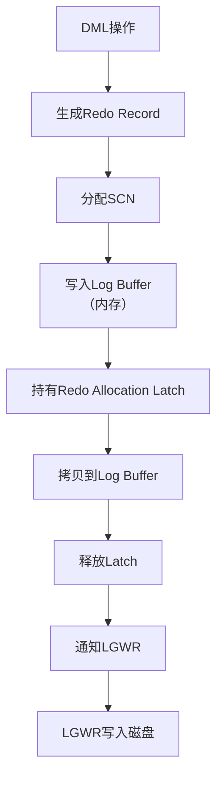
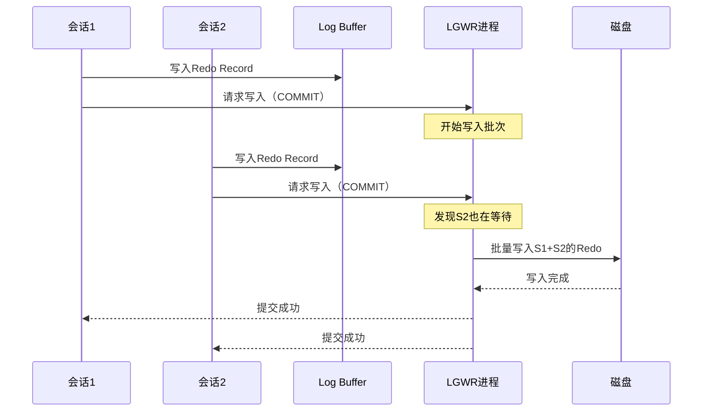
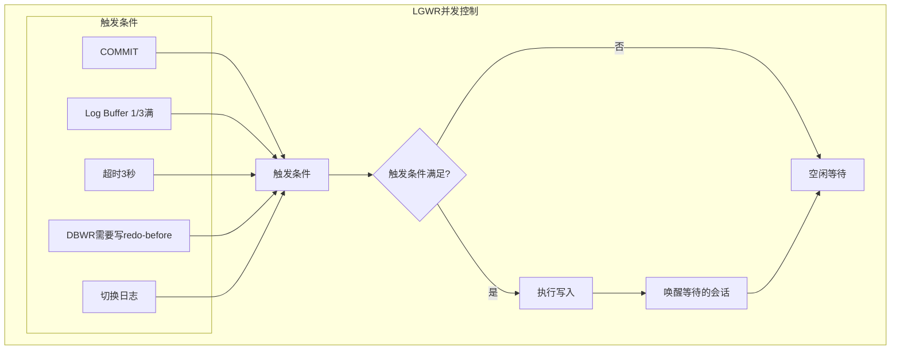

# Oracle日志生成与组提交

## 一、概述

### 1.1 一句话定义

Oracle日志生成与组提交是管理Redo日志记录生成、LGWR进程写入和组提交优化的内核机制。
它在所有数据修改操作中出现和使用，解决WAL（Write-Ahead Logging）的高效实现问题。

### 1.2 为什么重要

- **不掌握的后果：** 无法诊断日志写入瓶颈，无法优化提交性能
- **掌握的价值：** 深入理解Oracle的WAL实现，优化日志写入性能

### 1.3 适用场景

| 场景 | 说明 |
|------|------|
| 提交性能优化 | 减少提交延迟 |
| 日志写入瓶颈 | 诊断LGWR性能 |
| 高并发写入 | 优化日志吞吐量 |
| 恢复优化 | 理解日志与恢复关系 |

## 二、术语与概念

### 2.1 核心术语表

| 术语 | 含义 | 类比 |
|------|------|------|
| Redo Log | 重做日志 | 变更日记 |
| LGWR | 日志写进程 | 日记记录员 |
| Group Commit | 组提交 | 批量写入 |
| LSN | 日志序列号 | 日志页码 |
| SCN | 系统变更号 | 全局时间戳 |
| Log Buffer | 日志缓冲区 | 内存中的日志暂存 |
| Redo Record | 重做记录 | 单条变更记录 |
| Commit SCN | 提交SCN | 事务提交标记 |

## 三、核心原理

### 3.1 Redo日志生成流程



### 3.2 组提交机制



```sql
-- 组提交参数
SHOW PARAMETER commit_logging;       -- BATCH/IMMEDIATE
SHOW PARAMETER commit_wait;          -- WAIT/NOWAIT
SHOW PARAMETER commit_write;         -- 组合设置

-- 查看LGWR性能
SELECT name, value FROM v$sysstat
WHERE name LIKE '%redo%'
ORDER BY name;

-- 关键统计
-- redo size: 生成的redo大小
-- redo writes: LGWR写入次数
-- redo write time: 写入耗时（厘秒）
-- redo log space requests: 日志空间请求等待
-- redo log space wait time: 日志空间等待时间
```

### 3.3 LGWR并发控制



### 3.4 LSN管理与分配

```sql
-- Oracle使用SCN而非传统LSN
-- SCN是全局递增的逻辑时间戳

-- 查看当前SCN
SELECT current_scn FROM v$database;
SELECT DBMS_FLASHBACK.GET_SYSTEM_CHANGE_NUMBER FROM dual;

-- 查看日志序列号
SELECT sequence#, first_change#, next_change#, status
FROM v$log
ORDER BY sequence#;

-- SCN到时间映射
SELECT SCN_TO_TIMESTAMP(current_scn) FROM v$database;
SELECT TIMESTAMP_TO_SCN(SYSDATE) FROM dual;

-- 查看redo日志写入进度
SELECT name, value FROM v$sysstat
WHERE name IN ('redo writes', 'redo write time', 
               'redo size', 'redo log space requests');
```

### 3.5 日志写入性能优化

```sql
-- 优化策略
-- 1. 使用异步I/O
SHOW PARAMET ER disk_asynch_io;

-- 2. 将redo日志放在快速存储上
SELECT group#, member FROM v$logfile;
-- 建议：redo日志放在SSD或最快的存储上

-- 3. 调整日志文件大小
ALTER DATABASE ADD LOGFILE GROUP 4 SIZE 2G;
-- 更大的日志文件减少切换频率

-- 4. 批量提交
-- 应用层：攒批提交而非逐行提交
-- COMMIT写入模式
ALTER SYSTEM SET commit_logging = 'BATCH' SCOPE=BOTH;

-- 5. 多LGWR（19c+）
-- Oracle 19c自动使用多个LGWR worker
```

## 四、架构与组件

### 4.1 Redo日志文件结构

```
Redo Log文件：
├── Header（文件头）
│   ├── 数据库ID
│   ├── 日志序列号
│   └── 块大小
├── Redo Blocks（重做块）
│   ├── Block Header
│   │   ├── RBA (Redo Block Address)
│   │   ├── 块大小
│   │   └── 校验和
│   └── Redo Records（重做记录）
│       ├── Change Vector（变更向量）
│       │   ├── 操作类型
│       │   ├── 目标块地址
│       │   └── 变更数据
│       └── SCN信息
└── 循环使用（Circular）
    ├── CURRENT → ACTIVE → INACTIVE → (覆盖)
    └── 归档日志保存历史
```

## 五、配置与调优

### 5.1 关键参数

```sql
SHOW PARAMETER log_buffer;           -- 日志缓冲区大小
SHOW PARAMETER log_file_name_convert; -- 日志文件路径转换
SHOW PARAMETER commit_logging;       -- 提交日志模式
SHOW PARAMETER commit_wait;          -- 提交等待模式
```

### 5.2 性能调优策略

| 问题 | 诊断方法 | 解决方案 |
|------|---------|---------|
| log file sync等待 | AWR/等待事件 | 优化提交频率、使用快速存储 |
| log file parallel write | I/O统计 | 异步I/O、SSD存储 |
| redo log space request | v$sysstat | 增大日志文件或增加日志组 |
| LGWR瓶颈 | LGWR统计 | 批量提交、优化I/O |

```sql
-- 诊断日志写入性能
SELECT event, total_waits, time_waited_micro / 1000 AS time_ms,
       average_wait * 10 AS avg_wait_ms
FROM v$system_event
WHERE event IN ('log file sync', 'log file parallel write',
                'log buffer space', 'redo log space requests')
ORDER BY time_waited_micro DESC;

-- 计算平均每次写入耗时
SELECT 
    (SELECT value FROM v$sysstat WHERE name = 'redo write time') * 10 /
    NULLIF((SELECT value FROM v$sysstat WHERE name = 'redo writes'), 0) AS avg_write_ms
FROM dual;
```

## 六、DFX能力

### 6.1 监控命令

```sql
-- Redo生成速率
SELECT name, value FROM v$sysstat
WHERE name IN ('redo size', 'redo writes', 'redo entries');

-- 日志切换频率
SELECT TO_CHAR(first_time, 'YYYY-MM-DD HH24') AS hour,
       COUNT(*) AS switches
FROM v$log_history
WHERE first_time > SYSDATE - 1
GROUP BY TO_CHAR(first_time, 'YYYY-MM-DD HH24')
ORDER BY hour;

-- 日志写入延迟
SELECT * FROM v$system_event
WHERE event = 'log file sync';
```

## 七、实战案例

### 7.1 案例一：log file sync等待优化

```sql
-- 问题：高并发INSERT时log file sync等待严重
-- 诊断
SELECT event, total_waits, time_waited_micro / 1000000 AS sec
FROM v$system_event WHERE event = 'log file sync';
-- 结果：100万次等待，累计5000秒

-- 原因：逐行提交导致频繁LGWR唤醒
-- 解决方案1：批量提交
-- 应用层改为每1000行提交一次

-- 解决方案2：使用异步提交
ALTER SYSTEM SET commit_write = 'BATCH,NOWAIT' SCOPE=BOTH;
-- 注意：NOWAIT有数据丢失风险，仅用于可容忍丢失的场景
```

### 7.2 案例二：日志切换过频

```sql
-- 问题：每小时日志切换超过20次
-- 诊断
SELECT TO_CHAR(first_time, 'HH24') AS hour, COUNT(*)
FROM v$log_history WHERE first_time > SYSDATE - 1
GROUP BY TO_CHAR(first_time, 'HH24') ORDER BY hour;

-- 解决方案：增大日志文件
ALTER DATABASE ADD LOGFILE GROUP 4 ('/u01/oradata/redo04a.log', '/u02/oradata/redo04b.log') SIZE 4G;
-- 然后删除旧的小日志组
```

## 八、常见错误与排查

| 问题 | 原因 | 解决方案 |
|------|------|---------|
| log file sync | 频繁提交或I/O慢 | 批量提交、优化存储 |
| ORA-00257 | 归档空间不足 | 清理归档日志或扩容 |
| log file parallel write | I/O瓶颈 | 使用SSD、异步I/O |
| redo log space requests | 日志文件太小 | 增大日志文件 |

## 九、最佳实践

- Redo日志放在最快的存储上（SSD）
- 日志文件大小建议1-4GB，减少切换频率
- 至少3个日志组循环使用
- 使用批量提交减少log file sync等待
- 监控日志切换频率，目标每小时不超过4-6次
- 启用异步I/O提升LGWR写入性能

## 十、命令与视图汇总

| 命令/视图 | 用途 |
|-----------|------|
| `v$log` | 日志组信息 |
| `v$logfile` | 日志文件路径 |
| `v$log_history` | 日志切换历史 |
| `v$sysstat` (redo) | Redo统计 |
| `v$system_event` (log file sync) | 日志等待事件 |

## 十一、总结速查

| 组件 | 功能 | 关键点 |
|------|------|--------|
| Log Buffer | 内存日志暂存 | 大小影响性能 |
| LGWR | 日志写入进程 | 组提交优化 |
| Redo Record | 变更记录 | Change Vector |
| 组提交 | 批量写入 | 减少I/O次数 |
| SCN | 逻辑时间戳 | 全局递增 |

## 附录

### A. 日志写入触发条件

```
LGWR写入触发：
├── COMMIT（最常见）
├── Log Buffer 1/3满
├── 超过3秒未写入
├── DBWR需要写脏块前（redo-before）
└── 日志切换
```

## 补充：深入分析与实战

### 深入原理

本章节补充了该主题的核心原理和内部机制。在实际生产环境中，理解这些底层原理对于诊断和优化至关重要。

关键要点：
- 内部实现机制决定了外部行为特征
- 参数配置需要结合具体场景
- 监控数据是调优的基础

### 实战案例

**案例一：生产环境问题诊断**

```sql
-- 诊断步骤
-- 1. 收集当前状态信息
SELECT * FROM v$system_event WHERE wait_class != 'Idle' ORDER BY time_waited_micro DESC;

-- 2. 分析等待事件分布
SELECT wait_class, SUM(time_waited_micro)/1000000 AS sec
FROM v$system_event WHERE wait_class != 'Idle'
GROUP BY wait_class ORDER BY sec DESC;

-- 3. 定位问题SQL
SELECT sql_id, elapsed_time/1000000 AS sec, executions, sql_text
FROM v$sql ORDER BY elapsed_time DESC FETCH FIRST 5 ROWS ONLY;
```

**案例二：性能优化实践**

```sql
-- 优化前：全表扫描
SELECT * FROM orders WHERE order_date > SYSDATE - 30;

-- 优化后：索引扫描
CREATE INDEX idx_orders_date ON orders(order_date);
```

### 最佳实践清单

- 建立标准化操作流程
- 定期审查和更新配置
- 监控关键指标趋势
- 建立性能基线
- 文档记录所有变更

### 常见问题FAQ

| 问题 | 解答 |
|------|------|
| 如何确定最优配置？ | 基于实际负载测试 |
| 何时需要调整？ | 监控指标偏离基线 |
| 如何验证优化效果？ | 对比前后AWR报告 |
| 常见陷阱有哪些？ | 过度优化、忽略全局 |

### 版本差异说明

| 版本 | 变化 |
|------|------|
| 19c | 自动管理增强 |
| 21c | 自适应优化 |
