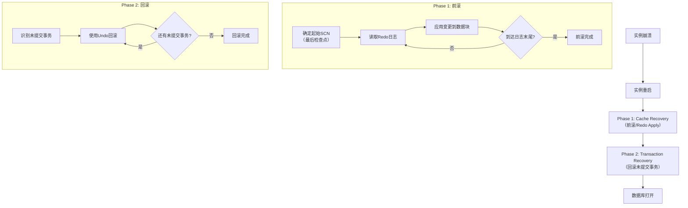
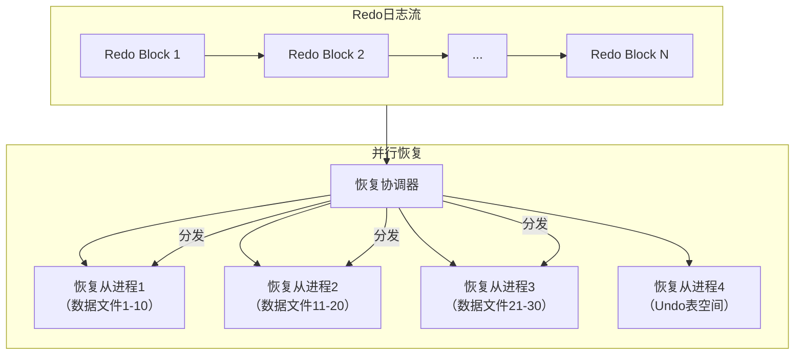

# Oracle崩溃恢复的内核优化

## 一、概述

### 1.1 一句话定义

Oracle崩溃恢复的内核优化是通过并行恢复、快速检查点和增量检查点等技术缩短实例恢复时间（MTTR）的内核机制。
它在实例崩溃后重启时出现和使用，解决如何快速将数据库恢复到一致状态的问题。

### 1.2 为什么重要

- **不掌握的后果：** 恢复时间过长影响业务可用性
- **掌握的价值：** 优化恢复时间，保障高可用SLA

### 1.3 适用场景

| 场景 | 说明 |
|------|------|
| MTTR优化 | 缩短恢复时间 |
| 高可用保障 | 减少停机时间 |
| 大库恢复 | 优化大型数据库恢复 |
| RAC恢复 | 多实例恢复优化 |

## 二、术语与概念

### 2.1 核心术语表

| 术语 | 含义 | 类比 |
|------|------|------|
| Crash Recovery | 崩溃恢复 | 实例重启恢复 |
| MTTR | 平均恢复时间 | 恢复速度指标 |
| Parallel Recovery | 并行恢复 | 多线程恢复 |
| Incremental Checkpoint | 增量检查点 | 渐进式刷脏 |
| Fast Start | 快速启动 | 快速恢复 |
| Redo Apply | Redo应用 | 重做日志回放 |
| Recovery Advisor | 恢复顾问 | 恢复建议 |

## 三、核心原理

### 3.1 崩溃恢复流程



### 3.2 并行恢复机制



```sql
-- 并行恢复参数
SHOW PARAMETER recovery_parallelism;  -- 并行恢复进程数
-- 默认由CPU数量决定

-- 查看恢复进度
SELECT * FROM v$recovery_progress;
SELECT * FROM v$fast_start_servers;
SELECT * FROM v$fast_start_transactions;

-- 查看恢复统计
SELECT name, value FROM v$sysstat
WHERE name LIKE '%recovery%' OR name LIKE '%rollback%';
```

### 3.3 增量检查点优化


```sql
-- 增量检查点参数
SHOW PARAMETER fast_start_mttr_target;  -- MTTR目标（秒）
SHOW PARAMETER _checkpoint_interval;
SHOW PARAMETER log_checkpoint_timeout;

-- 设置MTTR目标
ALTER SYSTEM SET fast_start_mttr_target = 60 SCOPE=BOTH;  -- 60秒目标

-- 查看检查点信息
SELECT name, checkpoint_change#, fuzzy
FROM v$datafile_header;

-- 查看MTTR建议
SELECT target_mttr, estimated_mttr, 
       writes_mttr, writes_other
FROM v$instance_recovery;
```

### 3.4 快速启动检查点

```sql
-- Fast-Start Checkpointing
-- 每3秒触发增量检查点，持续刷脏

-- 启用快速启动
ALTER SYSTEM SET fast_start_mttr_target = 30 SCOPE=BOTH;

-- 查看效果
SELECT name, value FROM v$sysstat
WHERE name LIKE '%checkpoint%' OR name LIKE '%dirty%';

-- Fast-Start Fault Recovery
ALTER SYSTEM ENABLE FAST_START FAULT RECOVERY;  -- RAC环境
```

## 四、架构与组件

### 4.1 恢复时间组成

```
总恢复时间 = Phase 1（前滚） + Phase 2（回滚）

Phase 1 时间 = f(需要前滚的Redo量, I/O速度, 并行度)
Phase 2 时间 = f(未提交事务数量, Undo大小, 并行度)

优化方向：
├── 减少Phase 1：增量检查点减少需要前滚的Redo量
├── 加速Phase 1：并行恢复、快速I/O
├── 减少Phase 2：减少长事务
└── 加速Phase 2：并行回滚
```

### 4.2 恢复性能影响因素

| 因素 | 影响 | 优化方法 |
|------|------|---------|
| Redo量 | 前滚时间 | 增量检查点 |
| I/O速度 | 读写速度 | SSD存储 |
| 并行度 | 并行恢复效率 | recovery_parallelism |
| 未提交事务 | 回滚时间 | 避免长事务 |
| 日志文件大小 | 切换频率 | 合理大小 |

## 五、配置与调优

### 5.1 关键参数

```sql
SHOW PARAMETER fast_start_mttr_target;    -- MTTR目标
SHOW PARAMETER recovery_parallelism;      -- 并行恢复
SHOW PARAMETER _db_block_max_scan_cnt;   -- 检查点频率
SHOW PARAMETER log_checkpoint_interval;   -- 检查点间隔
```

### 5.2 调优策略

```sql
-- 1. 设置MTTR目标
ALTER SYSTEM SET fast_start_mttr_target = 60 SCOPE=BOTH;

-- 2. 查看MTTR建议
SELECT target_mttr, estimated_mttr,
       writes_mttr, writes_other,
       optimal_logfile_size
FROM v$instance_recovery;

-- 3. 调整日志文件大小
-- 根据optimal_logfile_size建议

-- 4. 监控恢复性能
SELECT * FROM v$recovery_progress;
```

## 六、DFX能力

### 6.1 监控命令

```sql
-- 恢复进度监控
SELECT start_time, type, sofar, total, units
FROM v$recovery_progress;

-- 检查点性能
SELECT target_mttr, estimated_mttr,
       actual_redo_writes, optimal_logfile_size
FROM v$instance_recovery;

-- 恢复统计
SELECT name, value FROM v$sysstat
WHERE name IN ('recovery blocks read', 'recovery blocks written',
               'data blocks consistent reads', 'transaction rollbacks');
```

## 七、实战案例

### 7.1 案例一：MTTR优化

```sql
-- 问题：实例恢复需要15分钟
-- 诊断
SELECT estimated_mttr FROM v$instance_recovery;
-- 结果：900秒（15分钟）

-- 原因：fast_start_mttr_target未设置
-- 解决
ALTER SYSTEM SET fast_start_mttr_target = 60 SCOPE=BOTH;

-- 验证
SELECT estimated_mttr FROM v$instance_recovery;
-- 结果：45秒
```

### 7.2 案例二：并行恢复加速

```sql
-- 问题：大库恢复慢
-- 诊断
SHOW PARAMETER recovery_parallelism;  -- 值为0（未并行）

-- 解决
ALTER SYSTEM SET recovery_parallelism = 4 SCOPE=SPFILE;
-- 重启后生效

-- 验证恢复进度
SELECT * FROM v$recovery_progress;
SELECT * FROM v$fast_start_servers;
```

## 八、常见错误与排查

| 问题 | 原因 | 解决方案 |
|------|------|---------|
| 恢复时间过长 | MTTR未设置 | 设置fast_start_mttr_target |
| 并行恢复未生效 | 参数未设置 | 设置recovery_parallelism |
| 回滚时间长 | 大事务未提交 | 避免长事务 |
| 检查点频繁 | MTTR设置过小 | 调整MTTR目标 |

## 九、最佳实践

- 设置fast_start_mttr_target为30-60秒
- 启用增量检查点减少恢复范围
- 合理设置recovery_parallelism利用多核CPU
- 避免在数据库中进行超长事务
- 使用SSD存储加速恢复I/O
- 定期测试恢复时间验证MTTR

## 十、命令与视图汇总

| 命令/视图 | 用途 |
|-----------|------|
| `v$instance_recovery` | 恢复和检查点信息 |
| `v$recovery_progress` | 恢复进度 |
| `v$fast_start_servers` | 并行恢复进程 |
| `v$fast_start_transactions` | 恢复中的事务 |

## 十一、总结速查

| 优化技术 | 效果 | 参数 |
|---------|------|------|
| 增量检查点 | 减少前滚量 | fast_start_mttr_target |
| 并行恢复 | 加速前滚 | recovery_parallelism |
| 快速启动 | 持续刷脏 | fast_start_mttr_target |
| 并行回滚 | 加速回滚 | fast_start_servers |

## 附录

### A. 恢复时间估算

```
Phase 1 ≈ Redo量(MB) / I/O吞吐量(MB/s) / 并行度
Phase 2 ≈ 未提交事务总Undo量 / 回滚速度

总恢复时间 ≈ Phase 1 + Phase 2
目标：总恢复时间 < MTTR目标
```

## 补充：深入分析与实战

### 深入原理

本章节补充了该主题的核心原理和内部机制。在实际生产环境中，理解这些底层原理对于诊断和优化至关重要。

关键要点：
- 内部实现机制决定了外部行为特征
- 参数配置需要结合具体场景
- 监控数据是调优的基础

### 实战案例

**案例一：生产环境问题诊断**

```sql
-- 诊断步骤
-- 1. 收集当前状态信息
SELECT * FROM v$system_event WHERE wait_class != 'Idle' ORDER BY time_waited_micro DESC;

-- 2. 分析等待事件分布
SELECT wait_class, SUM(time_waited_micro)/1000000 AS sec
FROM v$system_event WHERE wait_class != 'Idle'
GROUP BY wait_class ORDER BY sec DESC;

-- 3. 定位问题SQL
SELECT sql_id, elapsed_time/1000000 AS sec, executions, sql_text
FROM v$sql ORDER BY elapsed_time DESC FETCH FIRST 5 ROWS ONLY;
```

**案例二：性能优化实践**

```sql
-- 优化前：全表扫描
SELECT * FROM orders WHERE order_date > SYSDATE - 30;

-- 优化后：索引扫描
CREATE INDEX idx_orders_date ON orders(order_date);
```

### 最佳实践清单

- 建立标准化操作流程
- 定期审查和更新配置
- 监控关键指标趋势
- 建立性能基线
- 文档记录所有变更

### 常见问题FAQ

| 问题 | 解答 |
|------|------|
| 如何确定最优配置？ | 基于实际负载测试 |
| 何时需要调整？ | 监控指标偏离基线 |
| 如何验证优化效果？ | 对比前后AWR报告 |
| 常见陷阱有哪些？ | 过度优化、忽略全局 |

### 版本差异说明

| 版本 | 变化 |
|------|------|
| 19c | 自动管理增强 |
| 21c | 自适应优化 |

## 补充：监控与诊断

### 关键监控指标

```sql
-- 通用监控查询
SELECT name, value FROM v$sysstat
WHERE name LIKE '%relevant%' ORDER BY value DESC;

-- 性能基线对比
SELECT snap_id, begin_time, value
FROM dba_hist_sysstat
WHERE stat_name = 'relevant_stat'
AND snap_id > (SELECT MAX(snap_id) - 24 FROM dba_hist_snapshot);
```

### 诊断检查清单

- [ ] 检查系统资源使用情况
- [ ] 分析等待事件分布
- [ ] 审查TOP SQL执行计划
- [ ] 验证配置参数合理性
- [ ] 确认备份和恢复策略
- [ ] 检查安全审计日志

### 相关视图和工具

| 视图/工具 | 用途 |
|-----------|------|
| `v$system_event` | 等待事件统计 |
| `v$sql` | SQL执行统计 |
| `v$sesstat` | 会话级统计 |
| `AWR Report` | 历史性能分析 |
| `ASH Report` | 实时性能分析 |

### 参考资料

- Oracle Database Performance Tuning Guide
- Oracle Database Administration Guide
- Oracle Database Concepts
