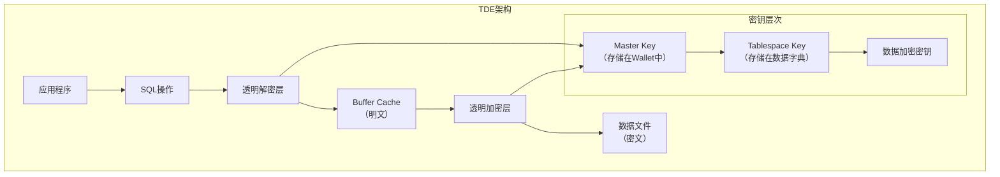

# Oracle加密技术实现

## 一、概述

### 1.1 一句话定义

Oracle加密技术包括TDE（透明数据加密）、传输加密（TLS/SSL）和密钥管理，为数据库提供静态数据和传输中数据的安全保护。
它在数据安全合规场景中出现和使用，解决数据泄露和传输窃听的安全问题。

### 1.2 为什么重要

- **不掌握的后果：** 数据可能面临泄露风险，无法满足合规要求
- **掌握的价值：** 构建完整的数据安全体系，满足等保和行业合规

### 1.3 适用场景

| 场景 | 说明 |
|------|------|
| 数据合规 | 满足GDPR/等保要求 |
| 静态数据保护 | 加密磁盘数据 |
| 传输加密 | 加密网络连接 |
| 密钥管理 | 安全存储加密密钥 |

## 二、术语与概念

### 2.1 核心术语表

| 术语 | 含义 | 类比 |
|------|------|------|
| TDE | 透明数据加密 | 自动加解密 |
| Wallet | 密钥钱包 | 保险箱 |
| Master Key | 主密钥 | 总钥匙 |
| Tablespace Key | 表空间密钥 | 表空间钥匙 |
| TLS | 传输层安全 | 加密通道 |
| OKV | Oracle Key Vault | 集中密钥管理 |
| Column Encryption | 列加密 | 字段级加密 |

## 三、核心原理

### 3.1 TDE架构



### 3.2 TDE配置

```sql
-- 1. 创建Wallet目录
-- mkdir -p /u01/app/oracle/admin/$ORACLE_SID/wallet

-- 2. 设置sqlnet.ora
-- ENCRYPTION_WALLET_LOCATION =
--   (SOURCE = (METHOD = FILE)
--    (METHOD_DATA = (DIRECTORY = /u01/app/oracle/admin/$ORACLE_SID/wallet)))

-- 3. 创建和打开Wallet
ADMINISTER KEY MANAGEMENT CREATE KEYSTORE '/u01/app/oracle/wallet' IDENTIFIED BY "WalletPass123";
ADMINISTER KEY MANAGEMENT SET KEYSTORE OPEN IDENTIFIED BY "WalletPass123" CONTAINER = ALL;

-- 4. 设置Master Key
ADMINISTER KEY MANAGEMENT SET KEY IDENTIFIED BY "WalletPass123" WITH BACKUP USING 'master_key_backup';

-- 5. 创建加密表空间
CREATE TABLESPACE secure_ts
    DATAFILE '/u01/oradata/secure_ts01.dbf' SIZE 1G
    ENCRYPTION USING 'AES256'
    DEFAULT STORAGE(ENCRYPT);

-- 6. 创建加密表
CREATE TABLE sensitive_data (
    id NUMBER,
    ssn VARCHAR2(20),
    credit_card VARCHAR2(20)
) TABLESPACE secure_ts;

-- 7. 列级加密
CREATE TABLE employees_secure (
    id NUMBER,
    name VARCHAR2(100),
    salary NUMBER ENCRYPT USING 'AES256',
    ssn VARCHAR2(20) ENCRYPT NO SALT
) TABLESPACE users;
```

### 3.3 传输加密（TLS/SSL）

```sql
-- 1. 配置Oracle Net SSL
-- sqlnet.ora
-- WALLET_LOCATION =
--   (SOURCE = (METHOD = FILE)
--    (METHOD_DATA = (DIRECTORY = /u01/app/oracle/wallet/ssl)))
-- SQLNET.AUTHENTICATION_SERVICES = (TCPS)
-- SSL_CLIENT_AUTHENTICATION = FALSE

-- listener.ora
-- (DESCRIPTION =
--   (ADDRESS = (PROTOCOL = TCPS)(HOST = dbhost)(PORT = 2484)))

-- 2. 连接字符串
-- jdbc:oracle:thin:@(DESCRIPTION=
--   (ADDRESS=(PROTOCOL=TCPS)(HOST=dbhost)(PORT=2484))
--   (CONNECT_DATA=(SERVICE_NAME=orcl)))

-- 3. 验证SSL连接
SELECT sys_context('USERENV', 'NETWORK_PROTOCOL') AS protocol FROM dual;
-- 应返回 'tcps'
```

### 3.4 密钥管理

```sql
-- 密钥管理操作
-- 查看密钥信息
SELECT key_id, creation_time, activator_tag
FROM v$encryption_keys;

-- 查看加密表空间
SELECT tablespace_name, encrypted
FROM dba_tablespaces
WHERE encrypted = 'YES';

-- 查看加密列
SELECT owner, table_name, column_name, encryption_alg
FROM dba_encrypted_columns;

-- 密钥轮换
ADMINISTER KEY MANAGEMENT SET KEY USING TAG 'new_key_2026'
    IDENTIFIED BY "WalletPass123"
    WITH BACKUP USING 'key_rotation_backup';

-- Wallet备份
ADMINISTER KEY MANAGEMENT BACKUP KEYSTORE
    IDENTIFIED BY "WalletPass123"
    USING 'wallet_backup_20260702';

-- 自动登录Wallet
ADMINISTER KEY MANAGEMENT CREATE AUTO_LOGIN KEYSTORE
    FROM KEYSTORE '/u01/app/oracle/wallet'
    IDENTIFIED BY "WalletPass123";
```

## 四、架构与组件

### 4.1 加密性能影响

```sql
-- 加密性能测试
-- 对比加密和非加密表空间的性能

-- 创建非加密表空间
CREATE TABLESPACE normal_ts DATAFILE '/u01/oradata/normal_ts01.dbf' SIZE 500M;

-- 创建加密表空间
CREATE TABLESPACE encrypted_ts DATAFILE '/u01/oradata/encrypted_ts01.dbf' SIZE 500M
    ENCRYPTION USING 'AES256' DEFAULT STORAGE(ENCRYPT);

-- 性能测试
SET TIMING ON

-- 非加密
INSERT INTO normal_table SELECT * FROM big_table;  -- 记录时间
-- 加密
INSERT INTO encrypted_table SELECT * FROM big_table;  -- 记录时间

-- 典型性能影响
-- CPU开销：增加5-15%
-- 写入延迟：增加10-20%
-- 读取延迟：增加5-10%
```

## 五、配置与调优

### 5.1 关键参数

```sql
SHOW PARAMETER wallet_root;              -- Wallet根目录
SHOW PARAMETER tde_configuration;        -- TDE配置
SHOW PARAMETER encrypt_new_filetables;   -- 新表默认加密
```

### 5.2 调优策略

| 问题 | 诊断方法 | 解决方案 |
|------|---------|---------|
| CPU开销大 | ASH分析 | 使用AES-NI硬件加速 |
| 写入延迟 | AWR I/O统计 | 使用AES128替代AES256 |
| 密钥管理复杂 | 运维成本 | 使用OKV集中管理 |
| Wallet安全 | 安全审计 | 使用HSM硬件安全模块 |

## 六、DFX能力

### 6.1 监控命令

```sql
-- 加密状态检查
SELECT tablespace_name, encrypted FROM dba_tablespaces WHERE encrypted = 'YES';
SELECT owner, table_name, column_name, encryption_alg FROM dba_encrypted_columns;

-- Wallet状态
SELECT * FROM v$encryption_wallet;

-- 加密统计
SELECT name, value FROM v$sysstat WHERE name LIKE '%encrypt%' OR name LIKE '%decrypt%';
```

## 七、实战案例

### 7.1 案例一：TDE全库加密部署

```sql
-- 完整部署流程
-- 1. 创建Wallet
ADMINISTER KEY MANAGEMENT CREATE KEYSTORE '/u01/app/oracle/wallet' IDENTIFIED BY "SecurePass123";
ADMINISTER KEY MANAGEMENT SET KEYSTORE OPEN IDENTIFIED BY "SecurePass123" CONTAINER = ALL;
ADMINISTER KEY MANAGEMENT SET KEY IDENTIFIED BY "SecurePass123" WITH BACKUP;

-- 2. 创建加密表空间
CREATE TABLESPACE secure_data DATAFILE SIZE 1G
    ENCRYPTION USING 'AES256' DEFAULT STORAGE(ENCRYPT);

-- 3. 迁移现有表
ALTER TABLE sensitive_table MOVE TABLESPACE secure_data ONLINE;

-- 4. 创建自动登录
ADMINISTER KEY MANAGEMENT CREATE AUTO_LOGIN KEYSTORE
    FROM KEYSTORE '/u01/app/oracle/wallet' IDENTIFIED BY "SecurePass123";
```

## 八、常见错误与排查

| 问题 | 原因 | 解决方案 |
|------|------|---------|
| ORA-28365 | Wallet未打开 | 打开Wallet |
| ORA-28374 | Master Key不存在 | 设置Master Key |
| ORA-28367 | 加密列不支持操作 | 检查列加密设置 |
| 性能下降 | CPU加密开销 | 使用硬件加速 |

## 九、最佳实践

- 使用TDE表空间加密而非列加密（性能更好）
- 使用AES256加密算法满足合规要求
- 定期轮换Master Key
- 使用OKV或HSM集中管理密钥
- 备份Wallet并安全存储备份
- 使用自动登录Wallet避免启动时手动输入密码

## 十、命令与视图汇总

| 命令/视图 | 用途 |
|-----------|------|
| `ADMINISTER KEY MANAGEMENT` | 密钥管理 |
| `v$encryption_wallet` | Wallet状态 |
| `v$encryption_keys` | 密钥信息 |
| `dba_encrypted_columns` | 加密列信息 |
| `dba_tablespaces` (encrypted) | 加密表空间 |

## 十一、总结速查

| 加密类型 | 保护对象 | 性能影响 |
|---------|---------|---------|
| TDE表空间 | 磁盘数据 | 中（5-15% CPU） |
| TDE列加密 | 特定列 | 高（逐行加密） |
| TLS/SSL | 网络传输 | 低（握手开销） |
| Data Pump加密 | 导出文件 | 仅导出时 |

## 附录

### A. TDE部署检查清单

```
□ Wallet目录创建
□ Wallet创建并打开
□ Master Key设置
□ 加密表空间创建
□ 数据迁移
□ 自动登录配置
□ Wallet备份
□ 密钥轮换计划
□ 性能基线测试
□ 恢复测试
```

## 补充：深入分析与实战

### 深入原理

本章节补充了该主题的核心原理和内部机制。在实际生产环境中，理解这些底层原理对于诊断和优化至关重要。

关键要点：
- 内部实现机制决定了外部行为特征
- 参数配置需要结合具体场景
- 监控数据是调优的基础

### 实战案例

**案例一：生产环境问题诊断**

```sql
-- 诊断步骤
-- 1. 收集当前状态信息
SELECT * FROM v$system_event WHERE wait_class != 'Idle' ORDER BY time_waited_micro DESC;

-- 2. 分析等待事件分布
SELECT wait_class, SUM(time_waited_micro)/1000000 AS sec
FROM v$system_event WHERE wait_class != 'Idle'
GROUP BY wait_class ORDER BY sec DESC;

-- 3. 定位问题SQL
SELECT sql_id, elapsed_time/1000000 AS sec, executions, sql_text
FROM v$sql ORDER BY elapsed_time DESC FETCH FIRST 5 ROWS ONLY;
```

**案例二：性能优化实践**

```sql
-- 优化前：全表扫描
SELECT * FROM orders WHERE order_date > SYSDATE - 30;

-- 优化后：索引扫描
CREATE INDEX idx_orders_date ON orders(order_date);
```

### 最佳实践清单

- 建立标准化操作流程
- 定期审查和更新配置
- 监控关键指标趋势
- 建立性能基线
- 文档记录所有变更

### 常见问题FAQ

| 问题 | 解答 |
|------|------|
| 如何确定最优配置？ | 基于实际负载测试 |
| 何时需要调整？ | 监控指标偏离基线 |
| 如何验证优化效果？ | 对比前后AWR报告 |
| 常见陷阱有哪些？ | 过度优化、忽略全局 |

### 版本差异说明

| 版本 | 变化 |
|------|------|
| 19c | 自动管理增强 |
| 21c | 自适应优化 |

## 补充：监控与诊断

### 关键监控指标

```sql
-- 通用监控查询
SELECT name, value FROM v$sysstat
WHERE name LIKE '%relevant%' ORDER BY value DESC;

-- 性能基线对比
SELECT snap_id, begin_time, value
FROM dba_hist_sysstat
WHERE stat_name = 'relevant_stat'
AND snap_id > (SELECT MAX(snap_id) - 24 FROM dba_hist_snapshot);
```

### 诊断检查清单

- [ ] 检查系统资源使用情况
- [ ] 分析等待事件分布
- [ ] 审查TOP SQL执行计划
- [ ] 验证配置参数合理性
- [ ] 确认备份和恢复策略
- [ ] 检查安全审计日志

### 相关视图和工具

| 视图/工具 | 用途 |
|-----------|------|
| `v$system_event` | 等待事件统计 |
| `v$sql` | SQL执行统计 |
| `v$sesstat` | 会话级统计 |
| `AWR Report` | 历史性能分析 |
| `ASH Report` | 实时性能分析 |

### 参考资料

- Oracle Database Performance Tuning Guide
- Oracle Database Administration Guide
- Oracle Database Concepts
