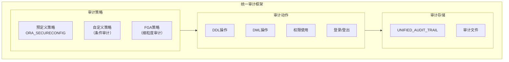
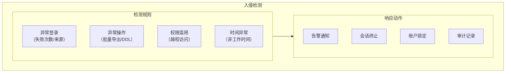

# Oracle高级审计与入侵检测

## 一、概述

### 1.1 一句话定义

Oracle高级审计通过统一审计框架（Unified Auditing）实现全面的数据库活动记录和监控，结合安全评估工具和入侵检测能力保障数据库安全。
它在安全合规和威胁检测场景中出现和使用，解决谁在何时对什么数据做了什么操作的问题。

### 1.2 为什么重要

- **不掌握的后果：** 无法满足安全合规要求，无法检测和追溯安全事件
- **掌握的价值：** 构建完整的安全审计体系，满足等保和行业监管

### 1.3 适用场景

| 场景 | 说明 |
|------|------|
| 安全合规 | 满足等保/GDPR/SOX |
| 入侵检测 | 检测异常访问 |
| 操作审计 | 记录DBA操作 |
| 数据保护 | 敏感数据访问监控 |

## 二、术语与概念

### 2.1 核心术语表

| 术语 | 含义 | 类比 |
|------|------|------|
| Unified Auditing | 统一审计 | 集中审计框架 |
| Audit Policy | 审计策略 | 审计规则 |
| Audit Trail | 审计跟踪 | 审计日志 |
| FGA | 细粒度审计 | 行级审计 |
| Security Assessment | 安全评估 | 安全检查 |
| Privilege Analysis | 权限分析 | 权限审计 |
| Real Application Security | 应用安全 | 应用层安全 |

## 三、核心原理

### 3.1 统一审计框架



### 3.2 统一审计配置

```sql
-- 1. 检查统一审计是否启用
SELECT value FROM v$option WHERE parameter = 'Unified Auditing';

-- 2. 创建审计策略
-- 审计所有DDL操作
CREATE AUDIT POLICY audit_ddl
    ACTIONS CREATE TABLE, ALTER TABLE, DROP TABLE,
            CREATE INDEX, DROP INDEX,
            CREATE VIEW, CREATE PROCEDURE;

-- 审计敏感表访问
CREATE AUDIT POLICY audit_sensitive_tables
    PRIVILEGES SELECT ANY TABLE
    ACTIONS SELECT ON hr.employees,
            UPDATE ON hr.employees,
            DELETE ON hr.employees;

-- 审计DBA操作
CREATE AUDIT POLICY audit_dba_actions
    ROLES DBA
    ACTIONS CREATE USER, ALTER USER, DROP USER,
            GRANT, REVOKE;

-- 条件审计
CREATE AUDIT POLICY audit_after_hours
    ACTIONS SELECT ON hr.salary_data
    WHEN 'TO_CHAR(SYSDATE, ''HH24'') NOT BETWEEN ''08'' AND ''18''' EVALUATE PER SESSION;

-- 3. 启用审计策略
AUDIT POLICY audit_ddl;
AUDIT POLICY audit_sensitive_tables;
AUDIT POLICY audit_dba_actions;
AUDIT POLICY audit_after_hours;

-- 4. 查看启用的策略
SELECT policy_name, enabled_option, entity_name
FROM audit_unified_enabled_policies;
```

### 3.3 审计日志查询

```sql
-- 查询统一审计跟踪
SELECT event_timestamp, dbusername, action_name,
       object_schema, object_name,
       sql_text, return_code
FROM unified_audit_trail
WHERE action_name IN ('SELECT', 'INSERT', 'UPDATE', 'DELETE')
AND object_schema = 'HR'
AND event_timestamp > SYSDATE - 1
ORDER BY event_timestamp DESC;

-- 查看失败的登录尝试
SELECT event_timestamp, dbusername, userhost,
       action_name, return_code
FROM unified_audit_trail
WHERE action_name = 'LOGON'
AND return_code != 0
AND event_timestamp > SYSDATE - 7;

-- 查看DDL变更历史
SELECT event_timestamp, dbusername, action_name,
       object_name, sql_text
FROM unified_audit_trail
WHERE action_name LIKE '%DDL%'
ORDER BY event_timestamp DESC;

-- 清理审计数据（保留90天）
BEGIN
    DBMS_AUDIT_MGMT.SET_LAST_ARCHIVE_TIMESTAMP(
        audit_trail_type => DBMS_AUDIT_MGMT.AUDIT_TRAIL_UNIFIED,
        last_archive_time => SYSTIMESTAMP - 90
    );
    DBMS_AUDIT_MGMT.CLEAN_AUDIT_TRAIL(
        audit_trail_type => DBMS_AUDIT_MGMT.AUDIT_TRAIL_UNIFIED,
        use_last_arch_timestamp => TRUE
    );
END;
/
```

### 3.4 细粒度审计（FGA）

```sql
-- 创建FGA策略
BEGIN
    DBMS_FGA.ADD_POLICY(
        object_schema => 'HR',
        object_name => 'EMPLOYEES',
        policy_name => 'fga_salary_access',
        audit_condition => 'salary > 100000',
        audit_column => 'SALARY,COMMISSION_PCT',
        handler_schema => 'SEC_ADMIN',
        handler_module => 'audit_alert',
        enable => TRUE,
        statement_types => 'SELECT,UPDATE',
        audit_trail => DBMS_FGA.DB + DBMS_FGA.EXTENDED
    );
END;
/

-- 查看FGA策略
SELECT object_schema, object_name, policy_name, 
       audit_condition, audit_column, enabled
FROM dba_audit_policies;

-- 查看FGA审计记录
SELECT timestamp, db_user, object_schema, object_name,
       sql_text, sql_bind
FROM dba_fga_audit_trail
ORDER BY timestamp DESC;
```

### 3.5 安全评估工具

```sql
-- 使用DBMS_SECASSESSMENT进行安全评估
-- 19c+ 提供安全评估功能

-- 执行安全评估
DECLARE
    v_report CLOB;
BEGIN
    v_report := DBMS_SECASSESSMENT.CREATE_ASSESSMENT_REPORT(
        assessment_type => DBMS_SECASSESSMENT.ASSESSMENT_TYPE_FULL
    );
    DBMS_OUTPUT.PUT_LINE(v_report);
END;
/

-- 查看安全评估结果
SELECT * FROM dba_security_assessment;

-- 权限分析
-- 创建权限捕获
CREATE CAPTURE priv_analysis CAPTURE USING
    (SELECT * FROM dba_role_privs UNION ALL
     SELECT * FROM dba_sys_privs);

-- 启用权限捕获
EXEC DBMS_PRIVILEGE_CAPTURE.ENABLE_CAPTURE(
    name => 'priv_analysis',
    type => DBMS_PRIVILEGE_CAPTURE.G_CONTEXT
);

-- 运行一段时间后禁用
EXEC DBMS_PRIVILEGE_CAPTURE.DISABLE_CAPTURE(name => 'priv_analysis');

-- 查看结果
SELECT * FROM dba_used_privs;
SELECT * FROM dba_unused_privs;
```

## 四、架构与组件

### 4.1 入侵检测方案



```sql
-- 入侵检测示例：异常登录检测
CREATE OR REPLACE TRIGGER detect_brute_force
AFTER SERVERERROR ON DATABASE
DECLARE
    v_count NUMBER;
BEGIN
    IF IS_SERVERERROR(1017) THEN  -- ORA-01017: 无效用户名/密码
        SELECT COUNT(*) INTO v_count
        FROM unified_audit_trail
        WHERE action_name = 'LOGON'
        AND return_code = 1017
        AND dbusername = SYS_CONTEXT('USERENV', 'SESSION_USER')
        AND event_timestamp > SYSDATE - 1/24;  -- 过去1小时
        
        IF v_count >= 5 THEN
            -- 记录告警
            INSERT INTO security_alerts(alert_type, alert_msg, alert_time)
            VALUES('BRUTE_FORCE', 'Multiple failed logins: ' || 
                   SYS_CONTEXT('USERENV', 'SESSION_USER'), SYSDATE);
        END IF;
    END IF;
END;
/
```

## 五、配置与调优

### 5.1 审计性能优化

```sql
-- 审计数据管理
-- 设置自动清理
BEGIN
    DBMS_AUDIT_MGMT.INIT_CLEANUP(
        audit_trail_type => DBMS_AUDIT_MGMT.AUDIT_TRAIL_UNIFIED,
        default_cleanup_interval => 24  -- 每24小时清理
    );
END;
/

-- 审计数据归档
CREATE TABLE audit_archive AS
SELECT * FROM unified_audit_trail WHERE 1=0;

-- 定期归档
INSERT INTO audit_archive
SELECT * FROM unified_audit_trail
WHERE event_timestamp < ADD_MONTHS(SYSDATE, -3);
```

## 六、DFX能力

### 6.1 监控命令

```sql
-- 审计策略状态
SELECT policy_name, enabled_opt, entity_name FROM audit_unified_enabled_policies;

-- 审计数据量
SELECT COUNT(*) AS total_records,
       MIN(event_timestamp) AS oldest,
       MAX(event_timestamp) AS newest
FROM unified_audit_trail;

-- 审计性能影响
SELECT name, value FROM v$sysstat WHERE name LIKE '%audit%';
```

## 七、实战案例

### 7.1 案例一：等保合规审计部署

```sql
-- 完整的等保审计配置
-- 1. 启用统一审计
-- 2. 创建审计策略
CREATE AUDIT POLICY compliance_audit
    PRIVILEGES CREATE ANY TABLE, DROP ANY TABLE,
               ALTER SYSTEM, GRANT ANY PRIVILEGE
    ACTIONS CREATE USER, ALTER USER, DROP USER,
            LOGON, LOGOFF,
            SELECT ON hr.employees,
            UPDATE ON hr.salary_data;

-- 3. 启用
AUDIT POLICY compliance_audit;

-- 4. 设置保留期（至少180天）
BEGIN
    DBMS_AUDIT_MGMT.SET_LAST_ARCHIVE_TIMESTAMP(
        audit_trail_type => DBMS_AUDIT_MGMT.AUDIT_TRAIL_UNIFIED,
        last_archive_time => SYSTIMESTAMP - 180
    );
END;
/
```

## 八、常见错误与排查

| 问题 | 原因 | 解决方案 |
|------|------|---------|
| 审计数据暴涨 | 策略过于宽泛 | 优化审计条件 |
| 性能下降 | 审计开销 | 异步审计或减少审计范围 |
| ORA-55917 | 审计空间不足 | 清理或归档审计数据 |

## 九、最佳实践

- 使用统一审计替代传统审计（12c+）
- 预定义策略ORA_SECURECONFIG覆盖基本安全需求
- 对敏感表使用FGA实现细粒度审计
- 定期执行权限分析，回收多余权限
- 审计数据保留至少180天满足合规要求
- 使用自动清理避免审计表空间膨胀

## 十、命令与视图汇总

| 命令/视图 | 用途 |
|-----------|------|
| `CREATE AUDIT POLICY` | 创建审计策略 |
| `AUDIT POLICY` | 启用审计策略 |
| `unified_audit_trail` | 统一审计日志 |
| `dba_audit_policies` | FGA策略 |
| `dba_fga_audit_trail` | FGA审计记录 |
| `DBMS_AUDIT_MGMT` | 审计管理包 |
| `DBMS_FGA` | 细粒度审计包 |

## 十一、总结速查

| 功能 | 用途 | 关键配置 |
|------|------|---------|
| 统一审计 | 全面审计 | CREATE AUDIT POLICY |
| FGA | 细粒度审计 | DBMS_FGA.ADD_POLICY |
| 权限分析 | 权限审计 | DBMS_PRIVILEGE_CAPTURE |
| 安全评估 | 安全检查 | DBMS_SECASSESSMENT |
| 入侵检测 | 威胁检测 | 自定义触发器 |

## 附录

### A. 审计策略模板

```sql
-- 基础安全审计策略
CREATE AUDIT POLICY base_security
    ACTIONS LOGON, LOGOFF,
            CREATE USER, ALTER USER, DROP USER,
            GRANT, REVOKE,
            ALTER SYSTEM;

-- 数据保护审计策略
CREATE AUDIT POLICY data_protection
    ACTIONS SELECT ON sensitive_table,
            INSERT ON sensitive_table,
            UPDATE ON sensitive_table,
            DELETE ON sensitive_table;
```
