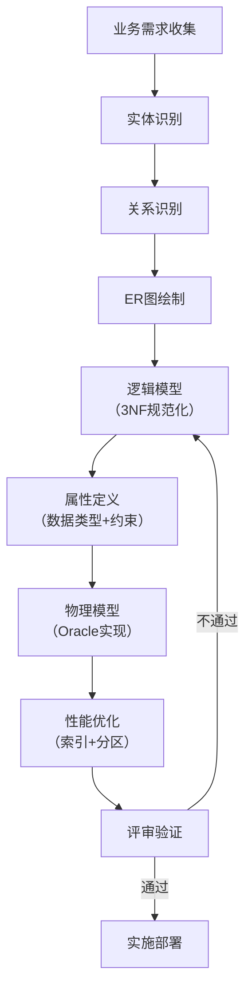

# Oracle业务需求到数据模型

## 一、概述

### 1.1 一句话定义

Oracle业务需求到数据模型是将业务需求通过概念模型、逻辑模型和物理模型三个层次转化为Oracle数据库表结构设计的系统化方法。
它在数据库项目启动阶段出现和使用，解决如何将业务语言转化为高效数据库设计的问题。

### 1.2 为什么重要

- **不掌握的后果：** 数据库设计不合理，后期频繁修改，性能差
- **掌握的价值：** 构建高质量数据模型，减少返工，提升系统性能

### 1.3 适用场景

| 场景 | 说明 |
|------|------|
| 新项目设计 | 从零开始设计数据库 |
| 系统重构 | 优化现有数据模型 |
| 数据迁移 | 异构系统数据模型转换 |
| 需求分析 | 业务需求到技术实现 |

## 二、术语与概念

### 2.1 核心术语表

| 术语 | 含义 | 类比 |
|------|------|------|
| 概念模型 | 业务实体关系 | 业务蓝图 |
| 逻辑模型 | 规范化表结构 | 技术蓝图 |
| 物理模型 | Oracle实现方案 | 施工图 |
| ER图 | 实体关系图 | 关系地图 |
| 范式 | 规范化规则 | 设计标准 |
| 反规范化 | 性能优化设计 | 实用妥协 |

## 三、核心原理

### 3.1 三层建模方法


### 3.2 概念模型设计

```
概念模型步骤：
1. 识别实体（Entity）
   - 从业务需求中提取名词
   - 例：客户、订单、产品、仓库

2. 识别关系（Relationship）
   - 从业务规则中提取动词
   - 例：客户"下"订单，订单"包含"产品

3. 确定基数（Cardinality）
   - 1:1（一对一）
   - 1:N（一对多）
   - M:N（多对多）

4. 绘制ER图
```

```sql
-- 示例：电商系统概念模型
-- 实体：Customer, Order, Product, OrderItem, Warehouse
-- 关系：
--   Customer 1:N Order
--   Order M:N Product（通过OrderItem）
--   Product N:1 Warehouse

-- ER图（Mermaid）
-- erDiagram
--     CUSTOMER ||--o{ ORDER : places
--     ORDER ||--|{ ORDER_ITEM : contains
--     PRODUCT ||--o{ ORDER_ITEM : "included in"
--     WAREHOUSE ||--o{ PRODUCT : stores
```

### 3.3 逻辑模型设计

```sql
-- 从概念模型转换为逻辑表结构
-- 1. 每个实体 → 一张表
-- 2. 每个属性 → 一个列
-- 3. 关系 → 外键

-- 逻辑模型（3NF规范化）
CREATE TABLE customers (
    customer_id   NUMBER PRIMARY KEY,
    customer_name VARCHAR2(200) NOT NULL,
    email         VARCHAR2(200) UNIQUE,
    phone         VARCHAR2(20),
    address       VARCHAR2(500),
    created_date  DATE DEFAULT SYSDATE
);

CREATE TABLE warehouses (
    warehouse_id   NUMBER PRIMARY KEY,
    warehouse_name VARCHAR2(100) NOT NULL,
    location       VARCHAR2(300)
);

CREATE TABLE products (
    product_id    NUMBER PRIMARY KEY,
    product_name  VARCHAR2(200) NOT NULL,
    category      VARCHAR2(100),
    unit_price    NUMBER(10,2) NOT NULL,
    warehouse_id  NUMBER REFERENCES warehouses(warehouse_id)
);

CREATE TABLE orders (
    order_id      NUMBER PRIMARY KEY,
    customer_id   NUMBER NOT NULL REFERENCES customers(customer_id),
    order_date    DATE DEFAULT SYSDATE,
    status        VARCHAR2(20) DEFAULT 'PENDING',
    total_amount  NUMBER(12,2)
);

CREATE TABLE order_items (
    order_id    NUMBER REFERENCES orders(order_id),
    product_id  NUMBER REFERENCES products(product_id),
    quantity    NUMBER NOT NULL,
    unit_price  NUMBER(10,2) NOT NULL,
    PRIMARY KEY (order_id, product_id)
);
```

### 3.4 物理模型设计

```sql
-- Oracle物理实现优化
-- 1. 表空间规划
CREATE TABLESPACE app_data DATAFILE SIZE 1G AUTOEXTEND ON MAXSIZE 10G;
CREATE TABLESPACE app_index DATAFILE SIZE 500M AUTOEXTEND ON MAXSIZE 5G;

-- 2. 存储参数优化
CREATE TABLE orders (
    order_id      NUMBER,
    customer_id   NUMBER NOT NULL,
    order_date    DATE DEFAULT SYSDATE,
    status        VARCHAR2(20) DEFAULT 'PENDING',
    total_amount  NUMBER(12,2)
) TABLESPACE app_data
PCTFREE 10
INITRANS 4
STORAGE (INITIAL 1M NEXT 1M);

-- 3. 索引策略
CREATE INDEX idx_orders_customer ON orders(customer_id) TABLESPACE app_index;
CREATE INDEX idx_orders_date ON orders(order_date) TABLESPACE app_index;

-- 4. 分区策略（大表）
ALTER TABLE orders MODIFY
    PARTITION BY RANGE (order_date) INTERVAL (NUMTOYMINTERVAL(1, 'MONTH'))
    (PARTITION p_init VALUES LESS THAN (DATE '2024-01-01'));

-- 5. 约束
ALTER TABLE orders ADD CONSTRAINT fk_orders_customer 
    FOREIGN KEY (customer_id) REFERENCES customers(customer_id);

ALTER TABLE orders ADD CONSTRAINT chk_order_status 
    CHECK (status IN ('PENDING', 'CONFIRMED', 'SHIPPED', 'DELIVERED', 'CANCELLED'));
```

## 四、架构与组件

### 4.1 建模流程



### 4.2 需求到模型的映射规则

| 业务概念 | 模型元素 | Oracle实现 |
|---------|---------|-----------|
| 实体 | 表 | CREATE TABLE |
| 属性 | 列 | 数据类型+约束 |
| 关系 | 外键 | FOREIGN KEY |
| 多对多 | 关联表 | 交叉表 |
| 业务规则 | 约束 | CHECK/触发器 |
| 唯一标识 | 主键 | PRIMARY KEY |
| 枚举值 | CHECK约束 | CHECK IN |

## 五、配置与调优

### 5.1 建模工具

| 工具 | 用途 | 特点 |
|------|------|------|
| ER/Studio | 企业级建模 | 支持多数据库 |
| PowerDesigner | SAP建模工具 | 全生命周期 |
| Oracle SQL Developer Data Modeler | Oracle官方 | 免费 |
| draw.io | 快速绘图 | 在线协作 |

### 5.2 建模质量检查

- 所有实体是否覆盖业务需求？
- 是否满足3NF（或明确反规范化原因）？
- 主键是否唯一标识每行？
- 外键关系是否正确？
- 数据类型是否合理？
- 是否考虑了扩展性？

## 六、DFX能力

### 6.1 数据字典管理

```sql
-- 添加数据字典注释
COMMENT ON TABLE customers IS '客户信息表 - 存储客户基本信息';
COMMENT ON COLUMN customers.customer_id IS '客户ID - 主键，序列生成';
COMMENT ON COLUMN customers.email IS '电子邮箱 - 唯一，用于登录';

-- 查看数据字典
SELECT table_name, comments FROM user_tab_comments WHERE table_name = 'CUSTOMERS';
SELECT column_name, comments FROM user_col_comments WHERE table_name = 'CUSTOMERS';
```

## 七、实战案例

### 7.1 案例：医院管理系统建模

```sql
-- 业务需求：
-- 1. 患者挂号就诊
-- 2. 医生开具处方
-- 3. 药房配药发药
-- 4. 收费结算

-- 概念模型
-- 实体：Patient, Doctor, Department, Registration, Prescription, Medicine, Payment

-- 逻辑模型
CREATE TABLE departments (
    dept_id   NUMBER PRIMARY KEY,
    dept_name VARCHAR2(100) NOT NULL
);

CREATE TABLE doctors (
    doctor_id   NUMBER PRIMARY KEY,
    doctor_name VARCHAR2(100) NOT NULL,
    dept_id     NUMBER REFERENCES departments(dept_id),
    title       VARCHAR2(50)
);

CREATE TABLE patients (
    patient_id   NUMBER PRIMARY KEY,
    patient_name VARCHAR2(100) NOT NULL,
    id_card      VARCHAR2(18) UNIQUE,
    phone        VARCHAR2(20)
);

CREATE TABLE registrations (
    reg_id      NUMBER PRIMARY KEY,
    patient_id  NUMBER REFERENCES patients(patient_id),
    doctor_id   NUMBER REFERENCES doctors(doctor_id),
    reg_time    DATE DEFAULT SYSDATE,
    status      VARCHAR2(20) DEFAULT 'WAITING'
);

CREATE TABLE prescriptions (
    prescription_id NUMBER PRIMARY KEY,
    reg_id          NUMBER REFERENCES registrations(reg_id),
    doctor_id       NUMBER REFERENCES doctors(doctor_id),
    prescribe_time  DATE DEFAULT SYSDATE
);

CREATE TABLE prescription_items (
    item_id         NUMBER PRIMARY KEY,
    prescription_id NUMBER REFERENCES prescriptions(prescription_id),
    medicine_name   VARCHAR2(200) NOT NULL,
    quantity        NUMBER NOT NULL,
    unit_price      NUMBER(10,2),
    dosage          VARCHAR2(100)
);
```

## 八、常见错误与排查

| 问题 | 原因 | 解决方案 |
|------|------|---------|
| 冗余数据 | 未规范化 | 分解到3NF |
| 查询性能差 | 缺少索引 | 分析查询添加索引 |
| 数据不一致 | 缺少约束 | 添加外键和CHECK |
| 扩展性差 | 硬编码 | 使用字典表 |

## 九、最佳实践

- 先做概念模型，再做逻辑模型，最后物理模型
- 逻辑模型至少满足3NF
- 物理模型根据查询模式优化（适度反规范化）
- 所有表和列添加注释说明
- 使用命名规范（小写+下划线）
- 预留扩展字段应对需求变化

## 十、命令与视图汇总

| 命令/视图 | 用途 |
|-----------|------|
| `CREATE TABLE` | 创建表 |
| `ALTER TABLE` | 修改表结构 |
| `COMMENT ON` | 添加注释 |
| `user_tab_comments` | 表注释 |
| `user_col_comments` | 列注释 |
| `dba_constraints` | 约束信息 |

## 十一、总结速查

| 阶段 | 产出 | 关键活动 |
|------|------|---------|
| 概念模型 | ER图 | 实体和关系识别 |
| 逻辑模型 | 表结构 | 规范化和属性定义 |
| 物理模型 | Oracle实现 | 存储优化和索引 |

## 附录

### A. 命名规范

```
表名：小写+下划线（如 order_items）
列名：小写+下划线（如 customer_id）
主键：pk_表名
外键：fk_表名_引用表名
索引：idx_表名_列名
约束：chk_表名_描述
序列：seq_表名
```

## 补充：深入分析与实战

### 深入原理

本章节补充了该主题的核心原理和内部机制。在实际生产环境中，理解这些底层原理对于诊断和优化至关重要。

关键要点：
- 内部实现机制决定了外部行为特征
- 参数配置需要结合具体场景
- 监控数据是调优的基础

### 实战案例

**案例一：生产环境问题诊断**

```sql
-- 诊断步骤
-- 1. 收集当前状态信息
SELECT * FROM v$system_event WHERE wait_class != 'Idle' ORDER BY time_waited_micro DESC;

-- 2. 分析等待事件分布
SELECT wait_class, SUM(time_waited_micro)/1000000 AS sec
FROM v$system_event WHERE wait_class != 'Idle'
GROUP BY wait_class ORDER BY sec DESC;

-- 3. 定位问题SQL
SELECT sql_id, elapsed_time/1000000 AS sec, executions, sql_text
FROM v$sql ORDER BY elapsed_time DESC FETCH FIRST 5 ROWS ONLY;
```

**案例二：性能优化实践**

```sql
-- 优化前：全表扫描
SELECT * FROM orders WHERE order_date > SYSDATE - 30;

-- 优化后：索引扫描
CREATE INDEX idx_orders_date ON orders(order_date);
```

### 最佳实践清单

- 建立标准化操作流程
- 定期审查和更新配置
- 监控关键指标趋势
- 建立性能基线
- 文档记录所有变更

### 常见问题FAQ

| 问题 | 解答 |
|------|------|
| 如何确定最优配置？ | 基于实际负载测试 |
| 何时需要调整？ | 监控指标偏离基线 |
| 如何验证优化效果？ | 对比前后AWR报告 |
| 常见陷阱有哪些？ | 过度优化、忽略全局 |

### 版本差异说明

| 版本 | 变化 |
|------|------|
| 19c | 自动管理增强 |
| 21c | 自适应优化 |
