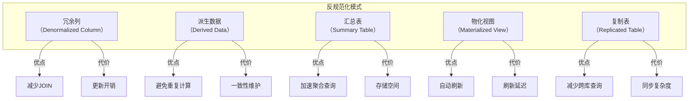
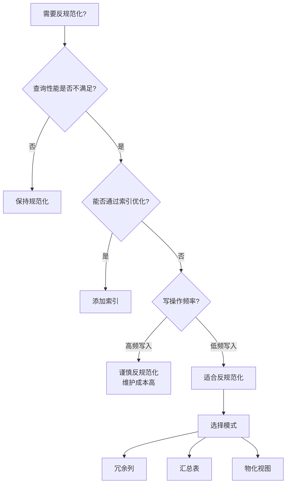

# Oracle反规范化设计模式

## 一、概述

### 1.1 一句话定义

Oracle反规范化设计是在规范化模型基础上，有目的地引入数据冗余以提升查询性能的设计方法，包括冗余列、汇总表、物化视图等模式。
它在读多写少的OLAP场景和高性能查询需求中出现和使用，解决规范化模型查询性能不足的问题。

### 1.2 为什么重要

- **不掌握的后果：** 查询性能差，大量JOIN操作导致响应慢
- **掌握的价值：** 在数据一致性和查询性能之间取得最佳平衡

### 1.3 适用场景

| 场景 | 说明 |
|------|------|
| 报表系统 | 复杂查询优化 |
| 数据仓库 | 星型/雪花模型 |
| 高频查询 | 减少JOIN操作 |
| 历史数据 | 汇总和聚合 |

## 二、术语与概念

### 2.1 核心术语表

| 术语 | 含义 | 类比 |
|------|------|------|
| 反规范化 | 引入冗余 | 有意的不完美 |
| 冗余列 | 重复存储的值 | 缓存副本 |
| 汇总表 | 预计算结果 | 快速通道 |
| 物化视图 | 查询结果缓存 | 快照 |
| 星型模型 | 维度建模 | 分析友好 |
| 雪花模型 | 规范化维度 | 存储友好 |

## 三、核心原理

### 3.1 反规范化模式分类



### 3.2 冗余列模式

```sql
-- 规范化模型：订单表需要JOIN客户表获取客户名
-- SELECT o.order_id, c.customer_name FROM orders o JOIN customers c ON o.customer_id = c.customer_id;

-- 反规范化：在订单表冗余存储客户名
CREATE TABLE orders_denorm (
    order_id      NUMBER PRIMARY KEY,
    customer_id   NUMBER NOT NULL,
    customer_name VARCHAR2(200),  -- 冗余列
    order_date    DATE,
    total_amount  NUMBER(12,2)
);

-- 维护冗余列
CREATE OR REPLACE TRIGGER trg_orders_denorm
BEFORE INSERT OR UPDATE OF customer_id ON orders_denorm
FOR EACH ROW
BEGIN
    SELECT customer_name INTO :NEW.customer_name
    FROM customers WHERE customer_id = :NEW.customer_id;
END;
/

-- 优点：查询无需JOIN
SELECT order_id, customer_name, total_amount FROM orders_denorm WHERE order_date > SYSDATE - 7;
```

### 3.3 汇总表模式

```sql
-- 创建日销售汇总表
CREATE TABLE daily_sales_summary (
    summary_date  DATE NOT NULL,
    product_id    NUMBER NOT NULL,
    total_qty     NUMBER NOT NULL,
    total_amount  NUMBER(12,2) NOT NULL,
    order_count   NUMBER NOT NULL,
    PRIMARY KEY (summary_date, product_id)
);

-- 定期刷新汇总数据
CREATE OR REPLACE PROCEDURE refresh_daily_sales(p_date DATE) IS
BEGIN
    DELETE FROM daily_sales_summary WHERE summary_date = p_date;
    
    INSERT INTO daily_sales_summary
    SELECT TRUNC(o.order_date), oi.product_id,
           SUM(oi.quantity), SUM(oi.quantity * oi.unit_price),
           COUNT(DISTINCT o.order_id)
    FROM orders o
    JOIN order_items oi ON o.order_id = oi.order_id
    WHERE TRUNC(o.order_date) = p_date
    GROUP BY TRUNC(o.order_date), oi.product_id;
    
    COMMIT;
END;
/

-- 使用DBMS_SCHEDULER定时执行
BEGIN
    DBMS_SCHEDULER.CREATE_JOB(
        job_name => 'REFRESH_DAILY_SALES',
        job_type => 'STORED_PROCEDURE',
        job_action => 'refresh_daily_sales',
        number_of_arguments => 1,
        start_date => SYSTIMESTAMP,
        repeat_interval => 'FREQ=DAILY; BYHOUR=1',
        enabled => FALSE
    );
    DBMS_SCHEDULER.SET_JOB_ARGUMENT_VALUE('REFRESH_DAILY_SALES', 1, 'TRUNC(SYSDATE-1)');
    DBMS_SCHEDULER.ENABLE('REFRESH_DAILY_SALES');
END;
/
```

### 3.4 物化视图模式

```sql
-- 创建物化视图
CREATE MATERIALIZED VIEW mv_monthly_sales
BUILD IMMEDIATE
REFRESH COMPLETE ON DEMAND
ENABLE QUERY REWRITE
AS
SELECT TO_CHAR(o.order_date, 'YYYY-MM') AS month,
       p.category,
       SUM(oi.quantity) AS total_qty,
       SUM(oi.quantity * oi.unit_price) AS total_amount,
       COUNT(DISTINCT o.customer_id) AS unique_customers
FROM orders o
JOIN order_items oi ON o.order_id = oi.order_id
JOIN products p ON oi.product_id = p.product_id
GROUP BY TO_CHAR(o.order_date, 'YYYY-MM'), p.category;

-- 自动刷新
BEGIN
    DBMS_MVIEW.REFRESH('MV_MONTHLY_SALES', 'C');  -- Complete refresh
END;
/

-- 查询重写（自动使用物化视图）
-- 原始查询
SELECT TO_CHAR(o.order_date, 'YYYY-MM'), p.category, SUM(oi.quantity)
FROM orders o JOIN order_items oi ON o.order_id = oi.order_id
JOIN products p ON oi.product_id = p.product_id
GROUP BY TO_CHAR(o.order_date, 'YYYY-MM'), p.category;
-- Oracle自动重写为查询物化视图

-- 查看物化视图刷新状态
SELECT mview_name, last_refresh_date, staleness
FROM user_mviews;
```

### 3.5 星型模型

```sql
-- 数据仓库星型模型
-- 事实表
CREATE TABLE sales_fact (
    sale_id       NUMBER PRIMARY KEY,
    date_key      NUMBER REFERENCES date_dim(date_key),
    product_key   NUMBER REFERENCES product_dim(product_key),
    customer_key  NUMBER REFERENCES customer_dim(customer_key),
    store_key     NUMBER REFERENCES store_dim(store_key),
    quantity      NUMBER,
    amount        NUMBER(12,2),
    cost          NUMBER(12,2)
);

-- 维度表（反规范化，包含层级关系）
CREATE TABLE product_dim (
    product_key   NUMBER PRIMARY KEY,
    product_name  VARCHAR2(200),
    category      VARCHAR2(100),
    subcategory   VARCHAR2(100),
    brand         VARCHAR2(100),
    unit_price    NUMBER(10,2)
);

CREATE TABLE customer_dim (
    customer_key  NUMBER PRIMARY KEY,
    customer_name VARCHAR2(200),
    city          VARCHAR2(100),
    province      VARCHAR2(100),
    age_group     VARCHAR2(20),
    gender        VARCHAR2(10)
);

-- 星型查询
SELECT d.category, d.province, SUM(f.amount)
FROM sales_fact f
JOIN product_dim d ON f.product_key = d.product_key
JOIN customer_dim c ON f.customer_key = c.customer_key
GROUP BY d.category, c.province;
```

## 四、架构与组件

### 4.1 反规范化决策框架



### 4.2 模式对比

| 模式 | 适用场景 | 一致性 | 维护成本 |
|------|---------|--------|---------|
| 冗余列 | 减少JOIN | 需触发器维护 | 中 |
| 汇总表 | 聚合查询 | 批量刷新 | 低 |
| 物化视图 | 复杂查询 | 自动刷新 | 低 |
| 星型模型 | 数据仓库 | 维度表稳定 | 低 |

## 五、配置与调优

### 5.1 一致性维护策略

```sql
-- 策略1：触发器维护（实时）
-- 见3.2节示例

-- 策略2：定时刷新（最终一致）
-- 见3.3节示例

-- 策略3：应用层维护
-- 在业务代码中同时更新主表和冗余数据

-- 策略4：物化视图日志（增量刷新）
CREATE MATERIALIZED VIEW LOG ON orders WITH ROWID;
CREATE MATERIALIZED VIEW LOG ON order_items WITH ROWID;

CREATE MATERIALIZED VIEW mv_order_summary
REFRESH FAST ON COMMIT
AS
SELECT o.customer_id, COUNT(*) AS order_count,
       SUM(oi.quantity * oi.unit_price) AS total_amount
FROM orders o, order_items oi
WHERE o.order_id = oi.order_id
GROUP BY o.customer_id;
```

## 六、DFX能力

### 6.1 监控反规范化效果

```sql
-- 查看物化视图使用
SELECT mview_name, last_refresh_date, staleness, refresh_mode
FROM user_mviews;

-- 查询重写统计
SELECT query_text, rewritten, rewrite_type
FROM v$mview_analysis;

-- 监控物化视图刷新性能
SELECT * FROM dba_mview_refresh_times;
```

## 七、实战案例

### 7.1 案例：电商报表优化

```sql
-- 问题：月度报表查询需要30分钟
-- 原因：5张大表JOIN + 聚合计算

-- 解决方案：物化视图 + 汇总表
CREATE MATERIALIZED VIEW mv_daily_report
REFRESH COMPLETE START WITH SYSDATE NEXT SYSDATE + 1/24
AS
SELECT TRUNC(o.order_date) AS report_date,
       p.category,
       c.province,
       COUNT(*) AS order_count,
       SUM(oi.quantity) AS total_qty,
       SUM(oi.quantity * oi.unit_price) AS total_amount
FROM orders o
JOIN order_items oi ON o.order_id = oi.order_id
JOIN products p ON oi.product_id = p.product_id
JOIN customers c ON o.customer_id = c.customer_id
GROUP BY TRUNC(o.order_date), p.category, c.province;

-- 优化后查询时间：< 1秒
```

## 八、常见错误与排查

| 问题 | 原因 | 解决方案 |
|------|------|---------|
| 数据不一致 | 冗余未及时更新 | 使用触发器或物化视图 |
| 更新性能下降 | 冗余维护开销 | 批量更新或异步刷新 |
| 存储空间暴涨 | 过度冗余 | 评估冗余必要性 |

## 九、最佳实践

- 先优化索引和SQL，再考虑反规范化
- 物化视图优先于手动汇总表（自动维护）
- 冗余列使用触发器自动维护一致性
- 数据仓库使用星型模型
- 定期验证反规范化数据的一致性
- 文档记录所有反规范化设计决策和原因

## 十、命令与视图汇总

| 命令/视图 | 用途 |
|-----------|------|
| `CREATE MATERIALIZED VIEW` | 创建物化视图 |
| `DBMS_MVIEW.REFRESH` | 手动刷新 |
| `user_mviews` | 物化视图信息 |
| `dba_mview_refresh_times` | 刷新历史 |

## 十一、总结速查

| 模式 | 优点 | 代价 | 适用场景 |
|------|------|------|---------|
| 冗余列 | 减少JOIN | 更新开销 | 读多写少 |
| 汇总表 | 加速聚合 | 存储+刷新 | 报表系统 |
| 物化视图 | 自动维护 | 刷新延迟 | 复杂查询 |
| 星型模型 | 分析友好 | 维度冗余 | 数据仓库 |

## 附录

### A. 反规范化检查清单

```
□ 已尝试索引和SQL优化
□ 明确了反规范化的目标
□ 选择了对应的模式
□ 设计了一致性维护方案
□ 评估了存储空间影响
□ 制定了监控计划
□ 文档记录了设计决策
```

## 补充：深入分析与实战

### 深入原理

本章节补充了该主题的核心原理和内部机制。在实际生产环境中，理解这些底层原理对于诊断和优化至关重要。

关键要点：
- 内部实现机制决定了外部行为特征
- 参数配置需要结合具体场景
- 监控数据是调优的基础

### 实战案例

**案例一：生产环境问题诊断**

```sql
-- 诊断步骤
-- 1. 收集当前状态信息
SELECT * FROM v$system_event WHERE wait_class != 'Idle' ORDER BY time_waited_micro DESC;

-- 2. 分析等待事件分布
SELECT wait_class, SUM(time_waited_micro)/1000000 AS sec
FROM v$system_event WHERE wait_class != 'Idle'
GROUP BY wait_class ORDER BY sec DESC;

-- 3. 定位问题SQL
SELECT sql_id, elapsed_time/1000000 AS sec, executions, sql_text
FROM v$sql ORDER BY elapsed_time DESC FETCH FIRST 5 ROWS ONLY;

-- 4. 检查执行计划
SELECT * FROM TABLE(DBMS_XPLAN.DISPLAY_CURSOR('&sql_id'));
```

**案例二：性能优化实践**

```sql
-- 优化前：全表扫描
SELECT * FROM orders WHERE order_date > SYSDATE - 30;

-- 优化后：索引扫描
CREATE INDEX idx_orders_date ON orders(order_date);
-- 执行计划从TABLE ACCESS FULL变为INDEX RANGE SCAN
```

### 最佳实践清单

- 建立标准化操作流程
- 定期审查和更新配置
- 监控关键指标趋势
- 建立性能基线
- 文档记录所有变更

### 常见问题FAQ

| 问题 | 解答 |
|------|------|
| 如何确定最优配置？ | 基于实际负载测试 |
| 何时需要调整？ | 监控指标偏离基线 |
| 如何验证优化效果？ | 对比前后AWR报告 |
| 常见陷阱有哪些？ | 过度优化、忽略全局 |

### 版本差异说明

| 版本 | 变化 |
|------|------|
| 19c | 自动管理增强 |
| 21c | 自适应优化 |
