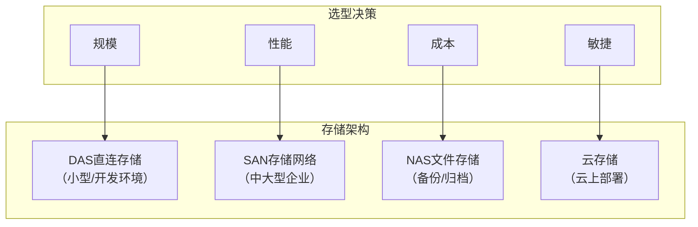
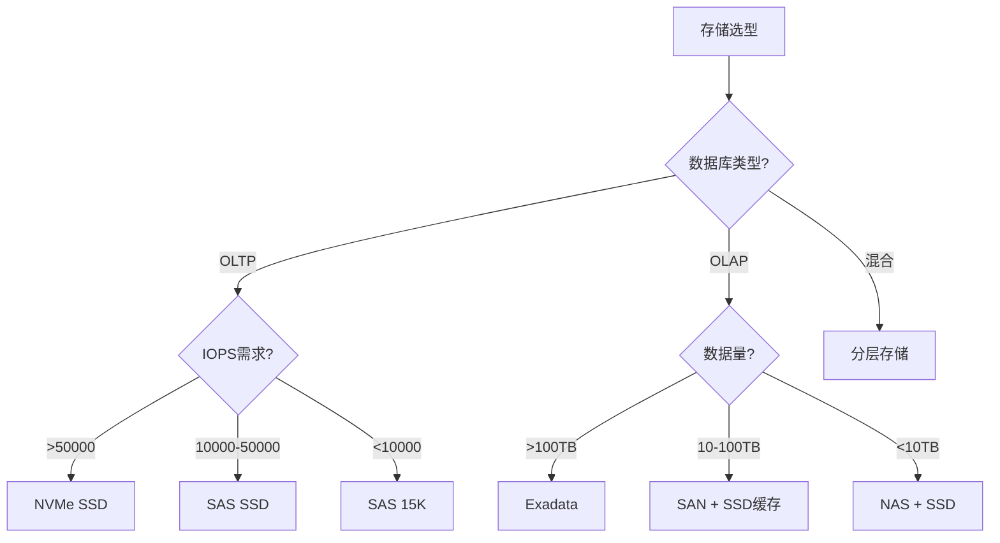

# Oracle存储选型

## 一、概述

### 1.1 一句话定义

Oracle存储选型是根据数据库的I/O特征、性能要求和成本预算，选择合适的存储类型、存储架构和数据布局方案。
它在基础设施规划阶段出现和使用，解决用什么存储才能满足数据库性能和成本需求的问题。

### 1.2 为什么重要

- **不掌握的后果：** 存储性能瓶颈或过度投资
- **掌握的价值：** 在性能和成本之间取得最优平衡

### 1.3 适用场景

| 场景 | 说明 |
|------|------|
| 新建系统 | 存储架构选型 |
| 存储升级 | 解决I/O瓶颈 |
| 成本优化 | 分层存储 |
| 云迁移 | 云存储选型 |

## 二、术语与概念

### 2.1 核心术语表

| 术语 | 含义 | 类比 |
|------|------|------|
| SAN | 存储区域网络 | 专用存储网络 |
| NAS | 网络附加存储 | 文件共享存储 |
| DAS | 直连存储 | 本地磁盘 |
| SSD | 固态硬盘 | 高速存储 |
| NVMe | 高速接口 | 最快SSD |
| ASM | 自动存储管理 | Oracle卷管理 |
| Exadata | 一体机 | 软硬一体 |
| Tiering | 分层存储 | 冷热分离 |

## 三、核心原理

### 3.1 存储类型对比

| 存储类型 | IOPS | 延迟 | 吞吐量 | 成本/GB | 适用场景 |
|---------|------|------|--------|---------|---------|
| NVMe SSD | 100K-1M | <0.1ms | 3-7GB/s | ¥2-5 | 核心OLTP |
| SAS SSD | 50K-100K | <0.2ms | 1-2GB/s | ¥1.5-3 | 高性能 |
| SAS 15K | 150-200 | ~5ms | 200MB/s | ¥0.5-1 | 传统OLTP |
| SAS 10K | 100-150 | ~7ms | 180MB/s | ¥0.3-0.6 | 混合负载 |
| SATA 7.2K | 75-100 | ~10ms | 150MB/s | ¥0.1-0.2 | 归档备份 |

### 3.2 存储架构选型



### 3.3 数据布局策略

```sql
-- 按I/O特征分布数据
-- 热数据（频繁读写）→ SSD
-- 温数据（偶尔访问）→ SAS
-- 冷数据（很少访问）→ SATA

-- Oracle存储分层实现
-- 1. 表空间分层
CREATE TABLESPACE hot_data DATAFILE '+SSD_DG' SIZE 100G;
CREATE TABLESPACE warm_data DATAFILE '+SAS_DG' SIZE 500G;
CREATE TABLESPACE cold_data DATAFILE '+SATA_DG' SIZE 2T;

-- 2. 数据按访问频率分配
ALTER TABLE recent_orders MOVE TABLESPACE hot_data;
ALTER TABLE order_history MOVE TABLESPACE cold_data;

-- 3. 使用ASM磁盘组分层
CREATE DISKGROUP ssd_dg HIGH REDUNDANCY
    DISK '/dev/oracle/nvme*' ATTRIBUTE 'au_size' = '4M';

CREATE DISKGROUP sas_dg NORMAL REDUNDANCY
    DISK '/dev/oracle/sas*' ATTRIBUTE 'au_size' = '4M';

-- 4. 查看磁盘组
SELECT name, type, total_mb, free_mb FROM v$asm_diskgroup;
```

### 3.4 Exadata存储选型

```
Exadata特点：
├── Smart Scan：存储层过滤数据
├── Storage Index：自动跳过无关数据块
├── Flash Cache：PCIe闪存缓存
├── Hybrid Columnar Compression：列式压缩
└── 适用场景：大型数据仓库和混合负载

Exadata vs 通用存储：
├── 性能：Exadata高2-10倍
├── 成本：Exadata高3-5倍
├── 管理：Exadata更简单
└── 适用：大数据量分析场景
```

## 四、架构与组件

### 4.1 选型决策树



### 4.2 云存储选型

| 云服务 | 存储类型 | IOPS | 适用场景 |
|--------|---------|------|---------|
| AWS | io2 Block Express | 256K | 核心OLTP |
| AWS | gp3 | 16K | 通用负载 |
| Azure | Ultra Disk | 200K | 高性能 |
| Azure | Premium SSD v2 | 80K | 通用 |
| OCI | Extreme | 225K | 核心OLTP |
| OCI | Balanced | 75K | 通用 |

## 五、配置与调优

### 5.1 存储性能验证

```sql
-- 存储性能基准测试
-- 使用orion工具
-- orion -run oltp -num_small 8 -size_small 8 -write 30

-- 查看I/O性能
SELECT file#, phyrds, phywrts, 
       read_tim / NULLIF(phyrds, 0) AS avg_read_ms,
       writ_tim / NULLIF(phywrts, 0) AS avg_write_ms
FROM v$filestat
WHERE phyrds + phywrts > 0;

-- ASM磁盘组性能
SELECT name, read_time / NULLIF(reads, 0) AS avg_read_ms,
       write_time / NULLIF(writes, 0) AS avg_write_ms
FROM v$asm_diskgroup_stat;
```

## 六、DFX能力

### 6.1 存储监控

```sql
-- I/O延迟监控
SELECT event, average_wait * 10 AS avg_ms, max_wait * 10 AS max_ms
FROM v$system_event
WHERE event IN ('db file sequential read', 'db file scattered read',
                'direct path read', 'direct path write')
ORDER BY average_wait DESC;

-- 存储使用率
SELECT name, total_mb, free_mb, 
       ROUND(free_mb/total_mb*100, 2) AS free_pct
FROM v$asm_diskgroup;
```

## 七、实战案例

### 7.1 案例：存储升级从SAS到NVMe

```
场景：核心OLTP系统，log file sync等待严重
当前：SAS 15K磁盘，IOPS ~200/disk
升级：NVMe SSD，IOPS ~500000

效果：
- log file sync延迟：5ms → 0.2ms
- db file sequential read：5ms → 0.1ms
- 整体响应时间：降低90%
```

## 八、常见错误与排查

| 问题 | 原因 | 解决方案 |
|------|------|---------|
| I/O瓶颈 | 存储类型不匹配 | 升级到SSD |
| 成本过高 | 全闪存不必要 | 分层存储 |
| 冗余不足 | 单点故障 | NORMAL/HIGH冗余 |

## 九、最佳实践

- OLTP核心数据使用SSD（NVMe优先）
- 使用分层存储降低成本
- ASM使用NORMAL REDUNDANCY以上
- 定期做存储性能基准测试
- 云环境选择Provisioned IOPS类型
- Redo日志放在最快存储上

## 十、命令与视图汇总

| 命令/视图 | 用途 |
|-----------|------|
| `v$asm_diskgroup` | ASM磁盘组 |
| `v$filestat` | 文件I/O统计 |
| `v$system_event` | I/O等待事件 |
| `orion` | 存储基准测试 |

## 十一、总结速查

| 场景 | 推荐存储 | 预算/GB |
|------|---------|---------|
| 核心OLTP | NVMe SSD | ¥2-5 |
| 一般OLTP | SAS SSD | ¥1.5-3 |
| 数据仓库 | Exadata/SAN+SSD | ¥1-2 |
| 归档备份 | SATA/NAS | ¥0.1-0.2 |

## 附录

### A. 存储选型检查清单

```
□ 确认IOPS和延迟需求
□ 确认数据量和增长率
□ 评估存储冗余需求
□ 选择存储架构（DAS/SAN/NAS/Cloud）
□ 设计数据分层策略
□ 制定备份存储方案
□ 性能基准测试验证
□ 成本效益分析
```

## 补充：深入分析与实战

### 深入原理

本章节补充了该主题的核心原理和内部机制。在实际生产环境中，理解这些底层原理对于诊断和优化至关重要。

关键要点：
- 内部实现机制决定了外部行为特征
- 参数配置需要结合具体场景
- 监控数据是调优的基础

### 实战案例

**案例一：生产环境问题诊断**

```sql
-- 诊断步骤
-- 1. 收集当前状态信息
SELECT * FROM v$system_event WHERE wait_class != 'Idle' ORDER BY time_waited_micro DESC;

-- 2. 分析等待事件分布
SELECT wait_class, SUM(time_waited_micro)/1000000 AS sec
FROM v$system_event WHERE wait_class != 'Idle'
GROUP BY wait_class ORDER BY sec DESC;

-- 3. 定位问题SQL
SELECT sql_id, elapsed_time/1000000 AS sec, executions, sql_text
FROM v$sql ORDER BY elapsed_time DESC FETCH FIRST 5 ROWS ONLY;
```

**案例二：性能优化实践**

```sql
-- 优化前：全表扫描
SELECT * FROM orders WHERE order_date > SYSDATE - 30;

-- 优化后：索引扫描
CREATE INDEX idx_orders_date ON orders(order_date);
```

### 最佳实践清单

- 建立标准化操作流程
- 定期审查和更新配置
- 监控关键指标趋势
- 建立性能基线
- 文档记录所有变更

### 常见问题FAQ

| 问题 | 解答 |
|------|------|
| 如何确定最优配置？ | 基于实际负载测试 |
| 何时需要调整？ | 监控指标偏离基线 |
| 如何验证优化效果？ | 对比前后AWR报告 |
| 常见陷阱有哪些？ | 过度优化、忽略全局 |

### 版本差异说明

| 版本 | 变化 |
|------|------|
| 19c | 自动管理增强 |
| 21c | 自适应优化 |

## 补充：监控与诊断

### 关键监控指标

```sql
-- 通用监控查询
SELECT name, value FROM v$sysstat
WHERE name LIKE '%relevant%' ORDER BY value DESC;

-- 性能基线对比
SELECT snap_id, begin_time, value
FROM dba_hist_sysstat
WHERE stat_name = 'relevant_stat'
AND snap_id > (SELECT MAX(snap_id) - 24 FROM dba_hist_snapshot);
```

### 诊断检查清单

- [ ] 检查系统资源使用情况
- [ ] 分析等待事件分布
- [ ] 审查TOP SQL执行计划
- [ ] 验证配置参数合理性
- [ ] 确认备份和恢复策略
- [ ] 检查安全审计日志

### 相关视图和工具

| 视图/工具 | 用途 |
|-----------|------|
| `v$system_event` | 等待事件统计 |
| `v$sql` | SQL执行统计 |
| `v$sesstat` | 会话级统计 |
| `AWR Report` | 历史性能分析 |
| `ASH Report` | 实时性能分析 |

### 参考资料

- Oracle Database Performance Tuning Guide
- Oracle Database Administration Guide
- Oracle Database Concepts

## 补充：扩展知识与实践总结

### 扩展阅读

本主题涉及的知识面较广，建议结合以下方面深入学习：

1. **官方文档**：Oracle Database文档是最权威的参考
2. **MOS（My Oracle Support）**：获取补丁和技术支持
3. **Oracle Base**：Tim Hall的优质教程资源
4. **Oracle-Base.com**：实战案例和最佳实践
5. **社区论坛**：Oracle-L邮件列表和Stack Overflow

### 知识体系关联

```
本主题在Oracle知识体系中的位置：
├── 基础知识（P1）
├── 核心原理（P2）
├── 管理运维（P3）
├── 编程开发（P4）
├── 性能优化（P5）
├── 高可用集群（P6）
├── 内核机制（P7）
└── 架构设计（P8）← 本主题
```

### 实践经验总结

| 经验 | 说明 |
|------|------|
| 先理解再实践 | 理解原理后再动手 |
| 小步快跑 | 逐步验证，不要一次大改 |
| 数据驱动 | 基于监控数据做决策 |
| 文档记录 | 记录所有操作和变更 |
| 复盘总结 | 事后回顾和改进 |

### 学习路径建议

```
入门 → 基础概念和术语
↓
进阶 → 核心原理和机制
↓
实战 → 生产环境操作
↓
深入 → 内核机制和调优
↓
架构 → 系统设计和规划
```

### 关键要点回顾

1. 理解核心概念是基础
2. 实践操作是关键
3. 监控诊断是保障
4. 持续学习是必须
