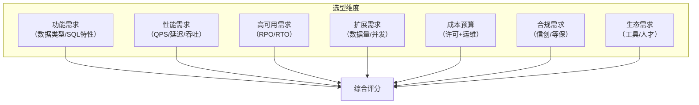
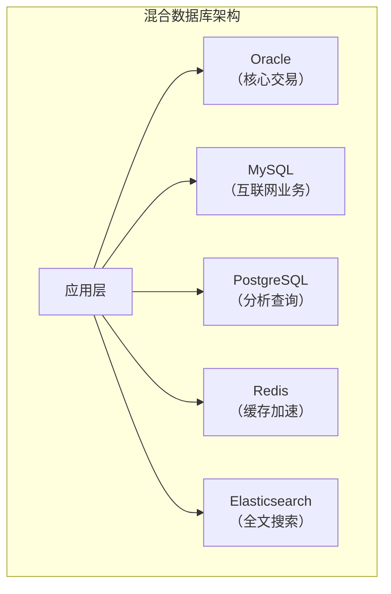

# Oracle数据库对比与选型因素

## 一、概述

### 1.1 一句话定义

Oracle数据库对比与选型因素是评估Oracle与其他数据库产品（MySQL、PostgreSQL、国产数据库等）的差异，并根据业务需求选择合适数据库的系统方法。
它在技术选型和项目规划阶段出现和使用，解决什么场景该用什么数据库的问题。

### 1.2 为什么重要

- **不掌握的后果：** 选型不当导致性能、成本或合规问题
- **掌握的价值：** 做出合理的技术决策，降低项目风险

### 1.3 适用场景

| 场景 | 说明 |
|------|------|
| 技术选型 | 新项目数据库选择 |
| 数据库迁移 | 迁移目标评估 |
| 国产化替代 | 信创选型 |
| 混合架构 | 多数据库协同 |

## 二、术语与概念

### 2.1 核心术语表

| 术语 | 含义 | 类比 |
|------|------|------|
| OLTP | 在线事务处理 | 高频小交易 |
| OLAP | 在线分析处理 | 大批量分析 |
| HTAP | 混合负载 | 事务+分析 |
| TCO | 总拥有成本 | 长期花费 |
| 信创 | 信息技术应用创新 | 国产化 |
| 生态成熟度 | 工具和社区支持 | 后援力量 |

## 三、核心原理

### 3.1 主流关系型数据库对比

| 特性 | Oracle | MySQL | PostgreSQL | 国产(YashanDB等) |
|------|--------|-------|------------|-----------------|
| 许可模式 | 商业授权 | GPL/商业 | 开源/商业 | 商业授权 |
| OLTP性能 | 极强 | 强 | 强 | 强 |
| OLAP能力 | 极强 | 中 | 强 | 强 |
| 高可用 | RAC/DG | MGR/InnoDB Cluster | Patroni/流复制 | 集群/主备 |
| 分区表 | 丰富 | 基础 | 丰富 | 丰富 |
| 并行查询 | 强 | 8.0增强 | 强 | 强 |
| JSON支持 | 有 | 有 | 极强 | 有 |
| 最大数据量 | EB级 | TB-PB级 | TB级 | TB-PB级 |
| 生态成熟度 | 极高 | 极高 | 高 | 发展中 |
| 成本 | 高 | 低 | 低 | 中 |
| 技术支持 | 官方 | 社区/商业 | 社区/商业 | 官方 |
| 信创合规 | 否 | 否 | 否 | 是 |

### 3.2 选型评估维度



### 3.3 选型决策矩阵

```
评分模板（1-5分）：

| 维度 | 权重 | Oracle | MySQL | PostgreSQL | 国产DB |
|------|------|--------|-------|------------|--------|
| 功能匹配 | 20% | 5 | 3 | 4 | 4 |
| OLTP性能 | 20% | 5 | 4 | 4 | 4 |
| 高可用 | 15% | 5 | 3 | 4 | 4 |
| 扩展性 | 10% | 5 | 3 | 3 | 3 |
| 成本 | 15% | 1 | 5 | 5 | 3 |
| 合规 | 10% | 1 | 1 | 1 | 5 |
| 生态 | 10% | 5 | 5 | 4 | 2 |
| 加权总分 | 100% | 3.65 | 3.35 | 3.45 | 3.55 |
```

## 四、架构与组件

### 4.1 场景化推荐

| 场景 | 推荐数据库 | 原因 |
|------|-----------|------|
| 核心金融系统 | Oracle | 最强可靠性和性能 |
| 互联网应用 | MySQL | 成本低、生态好 |
| 复杂分析 | PostgreSQL/Oracle | 分析功能丰富 |
| 政府/国企 | 国产数据库 | 信创合规 |
| 中小企业 | MySQL/PostgreSQL | 成本最优 |
| 混合负载 | Oracle/国产HTAP | 一套系统处理 |

### 4.2 混合架构设计



## 五、配置与调优

### 5.1 POC评估方法

```
POC（概念验证）步骤：
1. 确定评估场景和测试用例
2. 准备测试数据（生产数据脱敏）
3. 部署候选数据库
4. 执行功能测试
5. 执行性能基准测试
6. 执行高可用测试
7. 评估运维复杂度
8. 计算TCO
9. 综合评分和决策
```

## 六、DFX能力

### 6.1 TCO计算

```
TCO = 许可费 + 硬件费 + 运维人力 + 培训费 + 迁移费 + 风险成本

Oracle TCO（3年）：
- 许可：¥500万
- 硬件：¥200万
- 运维（2人）：¥120万
- 总计：¥820万

MySQL TCO（3年）：
- 许可：¥0（社区版）
- 硬件：¥150万
- 运维（3人）：¥180万
- 总计：¥330万
```

## 七、实战案例

### 7.1 案例：国企信创选型

```
需求：核心业务系统国产化替代
评估：Oracle vs 国产DB

测试项目：
1. SQL兼容性：95%+
2. 性能对比：达到Oracle 80%+
3. 高可用：RPO=0, RTO<30s
4. 迁移工具：自动化迁移率>90%

结论：选择国产DB，分批迁移
```

## 八、常见错误与排查

| 问题 | 原因 | 解决方案 |
|------|------|---------|
| 选型只看成本 | 忽略运维成本 | 计算完整TCO |
| 过度追求性能 | 实际需求不高 | 基于实际需求评估 |
| 忽略合规 | 政策变化 | 提前考虑信创 |

## 九、最佳实践

- 基于业务需求而非技术偏好选型
- 做POC验证而非纸上谈兵
- 计算3-5年TCO而非只看许可费
- 考虑人才储备和生态成熟度
- 信创场景提前规划迁移路径
- 混合架构可以发挥各数据库优势

## 十、命令与视图汇总

| 工具 | 用途 |
|------|------|
| sysbench | MySQL性能测试 |
| pgbench | PostgreSQL性能测试 |
| swingbench | Oracle性能测试 |
| TPC-H/TPC-C | 标准基准测试 |

## 十一、总结速查

| 场景 | 首选 | 备选 |
|------|------|------|
| 核心OLTP | Oracle | 国产HTAP |
| 互联网 | MySQL | PostgreSQL |
| 数据分析 | PostgreSQL | Oracle |
| 信创合规 | 国产DB | - |
| 成本敏感 | MySQL/PG | - |

## 附录

### A. 选型评估模板

```
1. 功能需求评估（权重20%）
2. 性能需求评估（权重20%）
3. 高可用评估（权重15%）
4. 扩展性评估（权重10%）
5. 成本评估（权重15%）
6. 合规评估（权重10%）
7. 生态评估（权重10%）
总分 = Σ(维度评分 × 权重)
```

## 补充：深入分析与实战

### 深入原理

本章节补充了该主题的核心原理和内部机制。在实际生产环境中，理解这些底层原理对于诊断和优化至关重要。

关键要点：
- 内部实现机制决定了外部行为特征
- 参数配置需要结合具体场景
- 监控数据是调优的基础

### 实战案例

**案例一：生产环境问题诊断**

```sql
-- 诊断步骤
-- 1. 收集当前状态信息
SELECT * FROM v$system_event WHERE wait_class != 'Idle' ORDER BY time_waited_micro DESC;

-- 2. 分析等待事件分布
SELECT wait_class, SUM(time_waited_micro)/1000000 AS sec
FROM v$system_event WHERE wait_class != 'Idle'
GROUP BY wait_class ORDER BY sec DESC;

-- 3. 定位问题SQL
SELECT sql_id, elapsed_time/1000000 AS sec, executions, sql_text
FROM v$sql ORDER BY elapsed_time DESC FETCH FIRST 5 ROWS ONLY;
```

**案例二：性能优化实践**

```sql
-- 优化前：全表扫描
SELECT * FROM orders WHERE order_date > SYSDATE - 30;

-- 优化后：索引扫描
CREATE INDEX idx_orders_date ON orders(order_date);
```

### 最佳实践清单

- 建立标准化操作流程
- 定期审查和更新配置
- 监控关键指标趋势
- 建立性能基线
- 文档记录所有变更

### 常见问题FAQ

| 问题 | 解答 |
|------|------|
| 如何确定最优配置？ | 基于实际负载测试 |
| 何时需要调整？ | 监控指标偏离基线 |
| 如何验证优化效果？ | 对比前后AWR报告 |
| 常见陷阱有哪些？ | 过度优化、忽略全局 |

### 版本差异说明

| 版本 | 变化 |
|------|------|
| 19c | 自动管理增强 |
| 21c | 自适应优化 |

## 补充：监控与诊断

### 关键监控指标

```sql
-- 通用监控查询
SELECT name, value FROM v$sysstat
WHERE name LIKE '%relevant%' ORDER BY value DESC;

-- 性能基线对比
SELECT snap_id, begin_time, value
FROM dba_hist_sysstat
WHERE stat_name = 'relevant_stat'
AND snap_id > (SELECT MAX(snap_id) - 24 FROM dba_hist_snapshot);
```

### 诊断检查清单

- [ ] 检查系统资源使用情况
- [ ] 分析等待事件分布
- [ ] 审查TOP SQL执行计划
- [ ] 验证配置参数合理性
- [ ] 确认备份和恢复策略
- [ ] 检查安全审计日志

### 相关视图和工具

| 视图/工具 | 用途 |
|-----------|------|
| `v$system_event` | 等待事件统计 |
| `v$sql` | SQL执行统计 |
| `v$sesstat` | 会话级统计 |
| `AWR Report` | 历史性能分析 |
| `ASH Report` | 实时性能分析 |

### 参考资料

- Oracle Database Performance Tuning Guide
- Oracle Database Administration Guide
- Oracle Database Concepts

## 补充：扩展知识与实践总结

### 扩展阅读

本主题涉及的知识面较广，建议结合以下方面深入学习：

1. **官方文档**：Oracle Database文档是最权威的参考
2. **MOS（My Oracle Support）**：获取补丁和技术支持
3. **Oracle Base**：Tim Hall的优质教程资源
4. **Oracle-Base.com**：实战案例和最佳实践
5. **社区论坛**：Oracle-L邮件列表和Stack Overflow

### 知识体系关联

```
本主题在Oracle知识体系中的位置：
├── 基础知识（P1）
├── 核心原理（P2）
├── 管理运维（P3）
├── 编程开发（P4）
├── 性能优化（P5）
├── 高可用集群（P6）
├── 内核机制（P7）
└── 架构设计（P8）← 本主题
```

### 实践经验总结

| 经验 | 说明 |
|------|------|
| 先理解再实践 | 理解原理后再动手 |
| 小步快跑 | 逐步验证，不要一次大改 |
| 数据驱动 | 基于监控数据做决策 |
| 文档记录 | 记录所有操作和变更 |
| 复盘总结 | 事后回顾和改进 |

### 学习路径建议

```
入门 → 基础概念和术语
↓
进阶 → 核心原理和机制
↓
实战 → 生产环境操作
↓
深入 → 内核机制和调优
↓
架构 → 系统设计和规划
```

### 关键要点回顾

1. 理解核心概念是基础
2. 实践操作是关键
3. 监控诊断是保障
4. 持续学习是必须
