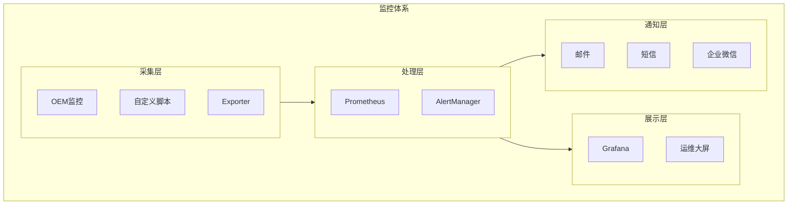

# Oracle监控体系建设

## 一、概述

### 1.1 一句话定义

Oracle监控体系建设是构建覆盖数据库性能、可用性、安全和容量的全方位监控体系，实现问题发现、告警和诊断的自动化。
它在运维体系搭建中出现和使用，解决如何及时发现和处理数据库问题的需求。

### 1.2 为什么重要

- **不掌握的后果：** 问题发现滞后，影响业务连续性
- **掌握的价值：** 保障数据库稳定运行，提升运维效率

### 1.3 适用场景

| 场景 | 说明 |
|------|------|
| 运维体系搭建 | 从零建设监控 |
| 告警优化 | 减少误报漏报 |
| 可视化 | 运维大屏 |
| 容量预警 | 提前发现风险 |

## 二、术语与概念

### 2.1 核心术语表

| 术语 | 含义 | 类比 |
|------|------|------|
| OEM | Oracle企业管理器 | 官方监控 |
| Prometheus | 开源监控 | 指标采集 |
| Grafana | 可视化工具 | 数据展示 |
| Alert | 告警 | 异常通知 |
| SLA | 服务等级协议 | 可用性承诺 |
| MTTR | 平均恢复时间 | 修复速度 |

## 三、核心原理

### 3.1 监控体系架构



### 3.2 监控指标体系

```
监控指标分类：
├── 可用性指标
│   ├── 实例状态（UP/DOWN）
│   ├── 表空间使用率
│   └── 归档空间使用率
├── 性能指标
│   ├── 响应时间（Average Wait Time）
│   ├── 吞吐量（TPS/QPS）
│   ├── 并发会话数
│   └── 等待事件分布
├── 资源指标
│   ├── CPU使用率
│   ├── 内存使用率
│   ├── I/O延迟和吞吐
│   └── 网络流量
├── 容量指标
│   ├── 表空间增长率
│   ├── 归档日志生成速率
│   └── Redo生成速率
└── 安全指标
    ├── 失败登录次数
    ├── 权限变更
    └── 异常操作
```

### 3.3 告警策略

```sql
-- 告警级别定义
-- P1（紧急）：实例宕机、数据损坏 → 5分钟内响应
-- P2（严重）：表空间>95%、主备中断 → 15分钟内响应
-- P3（警告）：表空间>85%、性能下降 → 1小时内响应
-- P4（通知）：增长趋势异常 → 下个工作日处理

-- 告警阈值设置
-- 表空间使用率
SELECT tablespace_name, used_percent
FROM dba_tablespace_usage_metrics
WHERE used_percent > 85;

-- 长时间运行的SQL
SELECT sid, serial#, username, sql_id, elapsed_seconds
FROM v$session_longops
WHERE elapsed_seconds > 300 AND sofar <> totalwork;

-- 阻塞链
SELECT blocking_session, COUNT(*) AS blocked_count
FROM v$session
WHERE blocking_session IS NOT NULL
GROUP BY blocking_session;
```

### 3.4 Prometheus + Grafana集成

```yaml
# oracledb_exporter配置
# docker-compose.yml
version: '3'
services:
  oracle_exporter:
    image: iamseth/oracledb_exporter
    environment:
      DATA_SOURCE_NAME: "system/password@//host:1521/service"
    ports:
      - "9161:9161"
  
  prometheus:
    image: prom/prometheus
    volumes:
      - ./prometheus.yml:/etc/prometheus/prometheus.yml
    ports:
      - "9090:9090"
  
  grafana:
    image: grafana/grafana
    ports:
      - "3000:3000"
```

```
# prometheus.yml
scrape_configs:
  - job_name: 'oracle'
    scrape_interval: 30s
    static_configs:
      - targets: ['oracle_exporter:9161']
```

## 四、架构与组件

### 4.1 OEM监控配置

```sql
-- OEM关键指标监控
-- 通过OEM模板配置告警规则
-- 1. 登录OEM Console
-- 2. Setup → Management Pack Access
-- 3. 配置Diagnostic Pack和Tuning Pack
-- 4. 设置Metric Extensions自定义指标
-- 5. 配置告警通知方法
```

### 4.2 自定义监控脚本

```sql
-- 健康检查脚本
-- 1. 实例状态
SELECT instance_name, status, database_status FROM v$instance;

-- 2. 表空间使用率
SELECT tablespace_name, ROUND(used_percent, 2) AS used_pct
FROM dba_tablespace_usage_metrics WHERE used_percent > 80
ORDER BY used_percent DESC;

-- 3. 无效对象
SELECT owner, object_type, COUNT(*) 
FROM dba_objects WHERE status = 'INVALID'
GROUP BY owner, object_type;

-- 4. 失败作业
SELECT owner, job_name, state, last_start_date, failure_count
FROM dba_scheduler_jobs WHERE state = 'BROKEN';

-- 5. 归档空间
SELECT name, space_limit/1024/1024/1024 AS limit_gb,
       space_used/1024/1024/1024 AS used_gb
FROM v$recovery_file_dest;
```

## 五、配置与调优

### 5.1 监控频率建议

| 指标类型 | 采集频率 | 保留时间 |
|---------|---------|---------|
| 可用性 | 10秒 | 1年 |
| 性能 | 30秒 | 3个月 |
| 容量 | 5分钟 | 1年 |
| 安全 | 1分钟 | 6个月 |

## 六、DFX能力

### 6.1 监控命令

```sql
-- 快速健康检查
SELECT 'Instance: ' || status FROM v$instance;
SELECT 'Sessions: ' || COUNT(*) FROM v$session WHERE type = 'USER';
SELECT 'Tablespace Alert: ' || COUNT(*) FROM dba_tablespace_usage_metrics WHERE used_percent > 85;
```

## 七、实战案例

### 7.1 案例：监控体系搭建

```
项目：100+ Oracle实例监控体系
方案：Prometheus + Grafana + AlertManager

实施：
1. 部署oracledb_exporter（每个实例）
2. 配置Prometheus采集
3. 导入Grafana Oracle Dashboard模板
4. 配置AlertManager告警规则
5. 集成企业微信通知

效果：
- 问题发现时间：从30分钟降至1分钟
- 误报率：从40%降至5%
- 运维效率提升：60%
```

## 八、常见错误与排查

| 问题 | 原因 | 解决方案 |
|------|------|---------|
| 告警风暴 | 阈值设置不合理 | 分级告警+抑制 |
| 监控盲区 | 指标覆盖不全 | 完善指标体系 |
| 误报频繁 | 采集间隔不当 | 调整采集频率 |

## 九、最佳实践

- 建立分层告警机制（P1-P4）
- 监控指标覆盖可用性、性能、容量、安全
- 使用Grafana构建统一运维大屏
- 定期回顾告警有效性，优化阈值
- 自动化健康检查每日执行
- 监控数据保留至少3个月用于趋势分析

## 十、命令与视图汇总

| 工具/视图 | 用途 |
|-----------|------|
| OEM | 官方监控平台 |
| Prometheus + Grafana | 开源监控方案 |
| oracledb_exporter | 指标导出 |
| `v$instance` | 实例状态 |
| `dba_tablespace_usage_metrics` | 表空间使用 |
| `v$session` | 会话监控 |

## 十一、总结速查

| 层级 | 功能 | 工具 |
|------|------|------|
| 采集层 | 指标采集 | Exporter/脚本 |
| 处理层 | 告警处理 | Prometheus/AlertManager |
| 展示层 | 可视化 | Grafana |
| 通知层 | 告警通知 | 邮件/短信/IM |

## 附录

### A. 监控指标清单

```
必监控指标：
□ 实例状态
□ 表空间使用率
□ 活跃会话数
□ 等待事件
□ CPU/内存/IO
□ 归档空间
□ 备份状态
□ 失败登录
```

## 补充：深入分析与实战

### 深入原理

本章节补充了该主题的核心原理和内部机制。在实际生产环境中，理解这些底层原理对于诊断和优化至关重要。

关键要点：
- 内部实现机制决定了外部行为特征
- 参数配置需要结合具体场景
- 监控数据是调优的基础

### 实战案例

**案例一：生产环境问题诊断**

```sql
-- 诊断步骤
-- 1. 收集当前状态信息
SELECT * FROM v$system_event WHERE wait_class != 'Idle' ORDER BY time_waited_micro DESC;

-- 2. 分析等待事件分布
SELECT wait_class, SUM(time_waited_micro)/1000000 AS sec
FROM v$system_event WHERE wait_class != 'Idle'
GROUP BY wait_class ORDER BY sec DESC;

-- 3. 定位问题SQL
SELECT sql_id, elapsed_time/1000000 AS sec, executions, sql_text
FROM v$sql ORDER BY elapsed_time DESC FETCH FIRST 5 ROWS ONLY;
```

**案例二：性能优化实践**

```sql
-- 优化前：全表扫描
SELECT * FROM orders WHERE order_date > SYSDATE - 30;

-- 优化后：索引扫描
CREATE INDEX idx_orders_date ON orders(order_date);
```

### 最佳实践清单

- 建立标准化操作流程
- 定期审查和更新配置
- 监控关键指标趋势
- 建立性能基线
- 文档记录所有变更

### 常见问题FAQ

| 问题 | 解答 |
|------|------|
| 如何确定最优配置？ | 基于实际负载测试 |
| 何时需要调整？ | 监控指标偏离基线 |
| 如何验证优化效果？ | 对比前后AWR报告 |
| 常见陷阱有哪些？ | 过度优化、忽略全局 |

### 版本差异说明

| 版本 | 变化 |
|------|------|
| 19c | 自动管理增强 |
| 21c | 自适应优化 |

## 补充：监控与诊断

### 关键监控指标

```sql
-- 通用监控查询
SELECT name, value FROM v$sysstat
WHERE name LIKE '%relevant%' ORDER BY value DESC;

-- 性能基线对比
SELECT snap_id, begin_time, value
FROM dba_hist_sysstat
WHERE stat_name = 'relevant_stat'
AND snap_id > (SELECT MAX(snap_id) - 24 FROM dba_hist_snapshot);
```

### 诊断检查清单

- [ ] 检查系统资源使用情况
- [ ] 分析等待事件分布
- [ ] 审查TOP SQL执行计划
- [ ] 验证配置参数合理性
- [ ] 确认备份和恢复策略
- [ ] 检查安全审计日志

### 相关视图和工具

| 视图/工具 | 用途 |
|-----------|------|
| `v$system_event` | 等待事件统计 |
| `v$sql` | SQL执行统计 |
| `v$sesstat` | 会话级统计 |
| `AWR Report` | 历史性能分析 |
| `ASH Report` | 实时性能分析 |

### 参考资料

- Oracle Database Performance Tuning Guide
- Oracle Database Administration Guide
- Oracle Database Concepts
