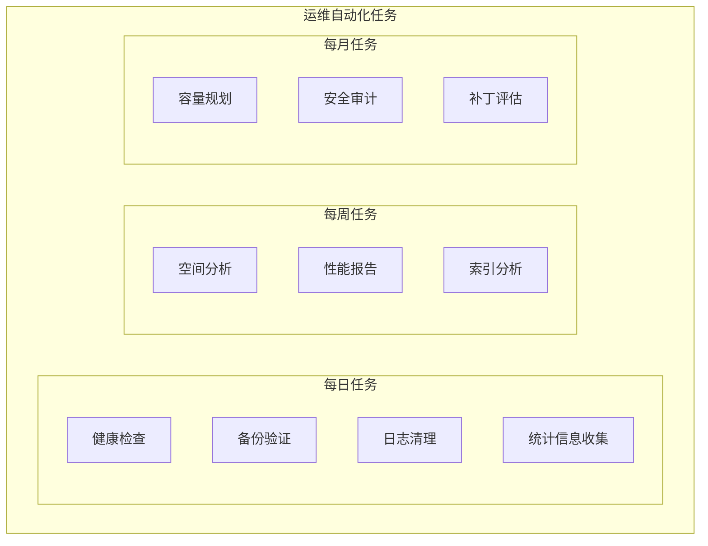

# Oracle日常运维自动化

## 一、概述

### 1.1 一句话定义

Oracle日常运维自动化是通过脚本、调度器和自动化工具将重复性运维工作（备份、巡检、维护）实现自动化执行，减少人工干预和出错风险。
它在日常运维中出现和使用，解决如何高效可靠地完成日常运维任务的问题。

### 1.2 为什么重要

- **不掌握的后果：** 运维效率低，人工操作易出错
- **掌握的价值：** 提升运维效率，保障操作一致性

### 1.3 适用场景

| 场景 | 说明 |
|------|------|
| 备份自动化 | 定时备份任务 |
| 巡检自动化 | 每日健康检查 |
| 维护自动化 | 统计信息收集等 |
| 告警自动化 | 自动处理和通知 |

## 二、术语与概念

### 2.1 核心术语表

| 术语 | 含义 | 类比 |
|------|------|------|
| DBMS_SCHEDULER | 调度器 | 定时任务 |
| Ansible | 自动化运维 | 批量执行 |
| Shell Script | 脚本 | 自动化命令 |
| Cron | 定时调度 | 系统定时 |

## 三、核心原理

### 3.1 自动化任务分类



### 3.2 DBMS_SCHEDULER自动化

```sql
-- 创建每日健康检查任务
BEGIN
    DBMS_SCHEDULER.CREATE_JOB(
        job_name => 'DAILY_HEALTH_CHECK',
        job_type => 'PLSQL_BLOCK',
        job_action => '
            BEGIN
                -- 检查表空间
                FOR r IN (SELECT tablespace_name, used_percent 
                          FROM dba_tablespace_usage_metrics 
                          WHERE used_percent > 85) LOOP
                    INSERT INTO alerts(msg, severity) 
                    VALUES(''Tablespace '' || r.tablespace_name || '' at '' || r.used_percent || ''%'', ''WARNING'');
                END LOOP;
                
                -- 检查无效对象
                FOR r IN (SELECT owner, COUNT(*) cnt FROM dba_objects 
                          WHERE status = ''INVALID'' GROUP BY owner) LOOP
                    INSERT INTO alerts(msg, severity) 
                    VALUES(''Invalid objects: '' || r.owner || '' ('' || r.cnt || '')'', ''INFO'');
                END LOOP;
                
                COMMIT;
            END;',
        start_date => SYSTIMESTAMP,
        repeat_interval => 'FREQ=DAILY; BYHOUR=8; BYMINUTE=0',
        enabled => TRUE,
        comments => '每日健康检查'
    );
END;
/

-- 创建自动备份任务
BEGIN
    DBMS_SCHEDULER.CREATE_JOB(
        job_name => 'RMAN_BACKUP',
        job_type => 'EXECUTABLE',
        job_action => '/u01/scripts/rman_backup.sh',
        start_date => SYSTIMESTAMP,
        repeat_interval => 'FREQ=DAILY; BYHOUR=2; BYMINUTE=0',
        enabled => TRUE,
        comments => '每日RMAN备份'
    );
END;
/

-- 查看调度任务
SELECT job_name, state, last_start_date, next_run_date, failure_count
FROM dba_scheduler_jobs
ORDER BY last_start_date DESC;
```

### 3.3 Shell脚本自动化

```bash
#!/bin/bash
# daily_check.sh - 每日健康检查脚本

ORACLE_SID=orcl
export ORACLE_SID

# 1. 检查实例状态
STATUS=$(sqlplus -s / as sysdba <<EOF
SET HEADING OFF FEEDBACK OFF
SELECT status FROM v\$instance;
EXIT;
EOF
)
echo "$(date) Instance Status: $STATUS"

# 2. 检查表空间
sqlplus -s / as sysdba <<EOF
SET HEADING ON LINESIZE 200
SELECT tablespace_name, ROUND(used_percent, 2) AS used_pct
FROM dba_tablespace_usage_metrics
WHERE used_percent > 80
ORDER BY used_percent DESC;
EXIT;
EOF

# 3. 检查告警日志
ALERT_LOG=$ORACLE_BASE/diag/rdbms/$ORACLE_SID/$ORACLE_SID/trace/alert_$ORACLE_SID.log
ERRORS=$(grep -c "ORA-" $ALERT_LOG 2>/dev/null || echo 0)
echo "$(date) Alert log errors: $ERRORS"

# 4. 检查备份状态
sqlplus -s / as sysdba <<EOF
SELECT input_type, status, 
       TO_CHAR(start_time, 'YYYY-MM-DD HH24:MI') AS start_time,
       TO_CHAR(end_time, 'YYYY-MM-DD HH24:MI') AS end_time
FROM v\$rman_backup_job_details
WHERE start_time > SYSDATE - 1
ORDER BY start_time DESC;
EXIT;
EOF
```

### 3.4 Ansible自动化

```yaml
# oracle_daily_check.yml
---
- name: Oracle Daily Health Check
  hosts: oracle_servers
  tasks:
    - name: Check instance status
      shell: |
        sqlplus -s / as sysdba <<EOF
        SELECT status FROM v$instance;
        EXIT;
        EOF
      register: instance_status
    
    - name: Check tablespace usage
      shell: |
        sqlplus -s / as sysdba <<EOF
        SELECT tablespace_name, used_percent 
        FROM dba_tablespace_usage_metrics 
        WHERE used_percent > 85;
        EXIT;
        EOF
      register: tablespace_check
    
    - name: Send alert if issues found
      mail:
        to: dba-team@company.com
        subject: "Oracle Alert - {{ inventory_hostname }}"
        body: "{{ tablespace_check.stdout }}"
      when: tablespace_check.stdout | length > 0
```

## 四、架构与组件

### 4.1 自动化运维流水线

```
定时触发 → 健康检查 → 异常检测 → 自动处理/告警
                ↓
          生成报告 → 发送通知 → 归档记录
```

## 五、配置与调优

### 5.1 自动化任务清单

| 任务 | 频率 | 自动化方式 |
|------|------|-----------|
| 健康检查 | 每日 | DBMS_SCHEDULER |
| RMAN备份 | 每日 | Shell + Cron |
| 归档清理 | 每日 | Shell脚本 |
| 统计信息收集 | 每日 | 自动维护窗口 |
| 性能报告 | 每周 | AWR自动生成 |
| 容量分析 | 每月 | 自定义脚本 |

## 六、DFX能力

### 6.1 监控自动化任务

```sql
-- 查看调度任务执行情况
SELECT job_name, state, last_start_date, next_run_date, 
       run_duration, failure_count
FROM dba_scheduler_jobs;

-- 查看任务执行日志
SELECT log_id, job_name, status, log_date, additional_info
FROM dba_scheduler_job_run_details
WHERE job_name = 'DAILY_HEALTH_CHECK'
ORDER BY log_date DESC;
```

## 七、实战案例

### 7.1 案例：完整自动化运维体系

```
实施内容：
1. 每日健康检查（DBMS_SCHEDULER）
2. 自动备份验证（Shell + RMAN）
3. 归档日志自动清理（Shell + Cron）
4. AWR报告自动生成（PL/SQL）
5. 月度容量报告（Python + SQL）

效果：
- 运维人力节省：60%
- 操作错误率：从5%降至0.1%
- 问题发现时间：从小时级降至分钟级
```

## 八、常见错误与排查

| 问题 | 原因 | 解决方案 |
|------|------|---------|
| 任务未执行 | 调度器未启动 | 检查JOB_QUEUE_PROCESSES |
| 任务失败 | 权限不足 | 授予必要权限 |
| 重复执行 | 间隔设置不当 | 检查repeat_interval |

## 九、最佳实践

- 所有定时任务使用DBMS_SCHEDULER而非DBMS_JOB
- 脚本执行结果记录到日志表
- 关键任务设置失败告警
- 定期审查自动化任务执行记录
- 使用Ansible管理多实例批量操作
- 自动化任务本身也需要监控

## 十、命令与视图汇总

| 命令/视图 | 用途 |
|-----------|------|
| `DBMS_SCHEDULER` | 任务调度 |
| `dba_scheduler_jobs` | 任务信息 |
| `dba_scheduler_job_run_details` | 执行日志 |
| `crontab` | 系统定时 |

## 十一、总结速查

| 任务 | 工具 | 频率 |
|------|------|------|
| 健康检查 | DBMS_SCHEDULER | 每日 |
| 备份 | RMAN + Shell | 每日 |
| 清理 | Shell + Cron | 每日 |
| 报告 | AWR + 脚本 | 每周/月 |

## 附录

### A. 自动化运维检查清单

```
□ 每日健康检查自动化
□ 备份任务自动化
□ 归档清理自动化
□ 告警通知自动化
□ 性能报告自动化
□ 任务执行监控
□ 异常自动处理
```

## 补充：深入分析与实战

### 深入原理

本章节补充了该主题的核心原理和内部机制。在实际生产环境中，理解这些底层原理对于诊断和优化至关重要。

关键要点：
- 内部实现机制决定了外部行为特征
- 参数配置需要结合具体场景
- 监控数据是调优的基础

### 实战案例

**案例一：生产环境问题诊断**

```sql
-- 诊断步骤
-- 1. 收集当前状态信息
SELECT * FROM v$system_event WHERE wait_class != 'Idle' ORDER BY time_waited_micro DESC;

-- 2. 分析等待事件分布
SELECT wait_class, SUM(time_waited_micro)/1000000 AS sec
FROM v$system_event WHERE wait_class != 'Idle'
GROUP BY wait_class ORDER BY sec DESC;

-- 3. 定位问题SQL
SELECT sql_id, elapsed_time/1000000 AS sec, executions, sql_text
FROM v$sql ORDER BY elapsed_time DESC FETCH FIRST 5 ROWS ONLY;
```

**案例二：性能优化实践**

```sql
-- 优化前：全表扫描
SELECT * FROM orders WHERE order_date > SYSDATE - 30;

-- 优化后：索引扫描
CREATE INDEX idx_orders_date ON orders(order_date);
```

### 最佳实践清单

- 建立标准化操作流程
- 定期审查和更新配置
- 监控关键指标趋势
- 建立性能基线
- 文档记录所有变更

### 常见问题FAQ

| 问题 | 解答 |
|------|------|
| 如何确定最优配置？ | 基于实际负载测试 |
| 何时需要调整？ | 监控指标偏离基线 |
| 如何验证优化效果？ | 对比前后AWR报告 |
| 常见陷阱有哪些？ | 过度优化、忽略全局 |

### 版本差异说明

| 版本 | 变化 |
|------|------|
| 19c | 自动管理增强 |
| 21c | 自适应优化 |

## 补充：监控与诊断

### 关键监控指标

```sql
-- 通用监控查询
SELECT name, value FROM v$sysstat
WHERE name LIKE '%relevant%' ORDER BY value DESC;

-- 性能基线对比
SELECT snap_id, begin_time, value
FROM dba_hist_sysstat
WHERE stat_name = 'relevant_stat'
AND snap_id > (SELECT MAX(snap_id) - 24 FROM dba_hist_snapshot);
```

### 诊断检查清单

- [ ] 检查系统资源使用情况
- [ ] 分析等待事件分布
- [ ] 审查TOP SQL执行计划
- [ ] 验证配置参数合理性
- [ ] 确认备份和恢复策略
- [ ] 检查安全审计日志

### 相关视图和工具

| 视图/工具 | 用途 |
|-----------|------|
| `v$system_event` | 等待事件统计 |
| `v$sql` | SQL执行统计 |
| `v$sesstat` | 会话级统计 |
| `AWR Report` | 历史性能分析 |
| `ASH Report` | 实时性能分析 |

### 参考资料

- Oracle Database Performance Tuning Guide
- Oracle Database Administration Guide
- Oracle Database Concepts
