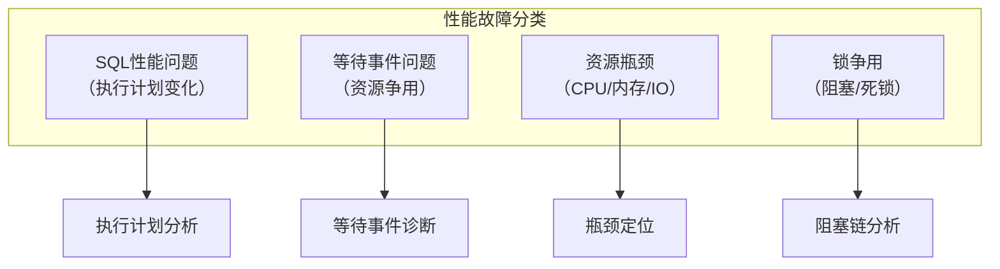
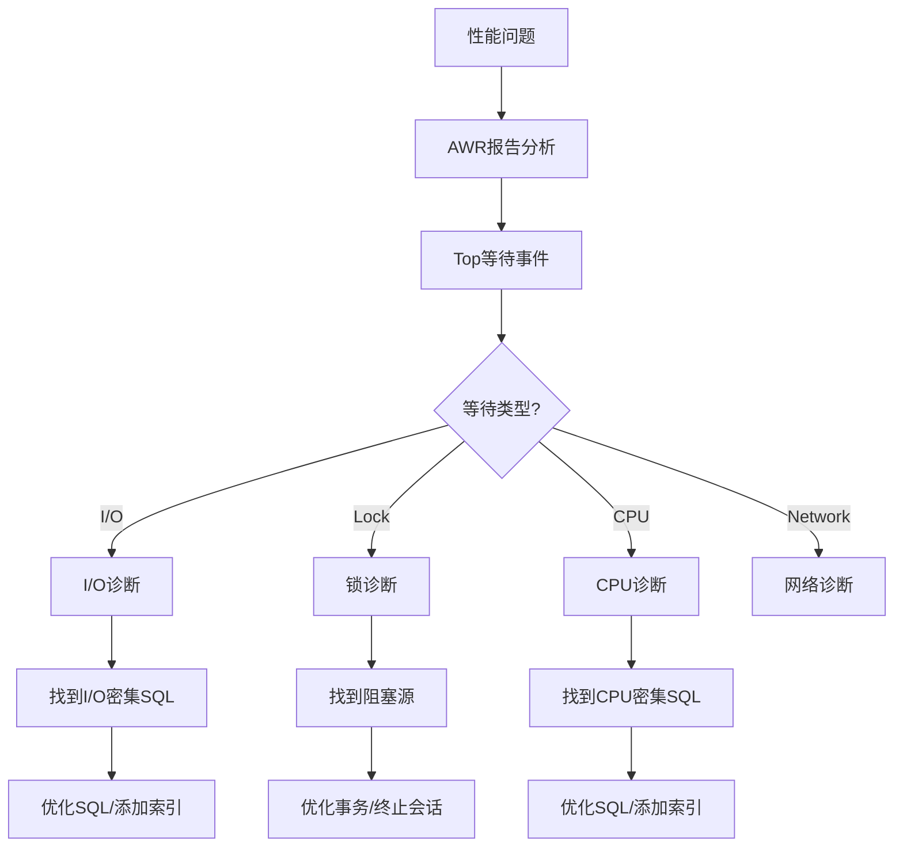

# Oracle典型性能故障

## 一、概述

### 1.1 一句话定义

Oracle典型性能故障是数据库运行中常见的性能问题，包括SQL性能退化、等待事件激增、Latch争用和I/O瓶颈等，需要系统化诊断和解决。
它在性能问题出现时被发现和使用，解决如何快速定位和修复性能故障的问题。

### 1.2 为什么重要

- **不掌握的后果：** 性能问题持续影响业务
- **掌握的价值：** 快速定位和解决性能故障

### 1.3 适用场景

| 场景 | 说明 |
|------|------|
| 性能退化 | 系统突然变慢 |
| 等待事件 | 特定等待激增 |
| SQL问题 | 单条SQL拖慢系统 |
| 资源争用 | CPU/内存/IO瓶颈 |

## 二、术语与概念

### 2.1 核心术语表

| 术语 | 含义 | 类比 |
|------|------|------|
| Wait Event | 等待事件 | 排队等待 |
| Execution Plan | 执行计划 | SQL执行路径 |
| Latch | 闩锁 | 轻量级锁 |
| AWR | 自动负载仓库 | 性能快照 |
| ASH | 活跃会话历史 | 实时采样 |

## 三、核心原理

### 3.1 性能故障分类



### 3.2 典型故障一：SQL性能退化

```sql
-- 诊断步骤
-- 1. 找到问题SQL
SELECT sql_id, elapsed_time/1000000 AS elapsed_sec,
       executions, elapsed_time/NULLIF(executions,0)/1000000 AS per_exec_sec,
       sql_text
FROM v$sql
WHERE elapsed_time > 10000000  -- > 10秒
ORDER BY elapsed_time DESC FETCH FIRST 10 ROWS ONLY;

-- 2. 检查执行计划变化
SELECT * FROM TABLE(DBMS_XPLAN.DISPLAY_CURSOR('&sql_id', NULL, 'ALLSTATS LAST'));

-- 3. 对比历史执行计划
SELECT plan_hash_value, executions, 
       elapsed_time/1000000 AS elapsed_sec
FROM dba_hist_sqlstat
WHERE sql_id = '&sql_id'
ORDER BY snap_id DESC;

-- 4. 常见原因和解决
-- a) 统计信息过期 → 收集统计信息
EXEC DBMS_STATS.GATHER_TABLE_STATS('HR', 'EMPLOYEES', CASCADE => TRUE);

-- b) 绑定变量窥探 → 使用SQL Profile
DECLARE
    v_profile VARCHAR2(100);
BEGIN
    v_profile := DBMS_SQLTUNE.CREATE_TUNING_TASK(sql_id => '&sql_id');
    DBMS_SQLTUNE.EXECUTE_TUNING_TASK(v_profile);
    DBMS_SQLTUNE.ACCEPT_SQL_PROFILE(task_name => v_profile);
END;
/

-- c) 数据量增长 → 添加索引或分区
```

### 3.3 典型故障二：等待事件激增

```sql
-- Top等待事件
SELECT event, wait_class, total_waits, 
       time_waited_micro/1000000 AS time_sec,
       average_wait*10 AS avg_ms
FROM v$system_event
WHERE wait_class != 'Idle'
ORDER BY time_waited_micro DESC FETCH FIRST 10 ROWS ONLY;

-- 常见等待事件诊断
-- 1. db file sequential read（单块读）
-- 原因：索引扫描过多或I/O慢
-- 诊断：检查I/O延迟
SELECT avg_wait*10 AS avg_ms FROM v$system_event WHERE event = 'db file sequential read';

-- 2. db file scattered read（多块读/全表扫描）
-- 原因：缺少索引导致全表扫描
-- 诊断：找到全表扫描的SQL
SELECT sql_id, disk_reads, buffer_gets, sql_text
FROM v$sql WHERE disk_reads > 10000 ORDER BY disk_reads DESC;

-- 3. log file sync（提交等待）
-- 原因：频繁提交或Redo I/O慢
-- 诊断：检查Redo写入延迟
SELECT average_wait*10 AS avg_ms FROM v$system_event WHERE event = 'log file sync';

-- 4. enq: TX - row lock contention（行锁争用）
-- 原因：并发修改同一行
-- 诊断：找到阻塞链
SELECT blocking_session, sid, event, seconds_in_wait
FROM v$session WHERE blocking_session IS NOT NULL;

-- 5. latch: cache buffers chains
-- 原因：热点块争用
-- 诊断：找到热点块
SELECT * FROM v$active_session_history
WHERE event = 'latch: cache buffers chains'
AND sample_time > SYSDATE - 1/24;
```

### 3.4 典型故障三：CPU瓶颈

```sql
-- CPU使用分析
SELECT stat_name, value/1000000 AS seconds
FROM v$sys_time_model WHERE stat_name LIKE '%CPU%';

-- 找到CPU消耗最高的SQL
SELECT sql_id, cpu_time/1000000 AS cpu_sec,
       executions, cpu_time/NULLIF(executions,0)/1000000 AS per_exec_sec,
       sql_text
FROM v$sql ORDER BY cpu_time DESC FETCH FIRST 10 ROWS ONLY;

-- ASH分析CPU消耗
SELECT sql_id, session_state, event, COUNT(*) AS ash_count
FROM v$active_session_history
WHERE session_state = 'ON CPU'
AND sample_time > SYSDATE - 1/24
GROUP BY sql_id, session_state, event
ORDER BY ash_count DESC;
```

## 四、架构与组件

### 4.1 性能故障诊断流程



## 五、配置与调优

### 5.1 快速诊断工具

| 工具 | 用途 | 适用场景 |
|------|------|---------|
| AWR | 历史性能分析 | 事后分析 |
| ASH | 实时性能采样 | 实时诊断 |
| SQL Monitor | SQL实时监控 | 大SQL分析 |
| SQL Trace | 详细SQL跟踪 | 深度分析 |

## 六、DFX能力

### 6.1 一键诊断脚本

```sql
-- 快速性能诊断
SELECT '=== Top Wait Events ===' FROM dual;
SELECT event, time_waited_micro/1000000 AS sec FROM v$system_event
WHERE wait_class != 'Idle' ORDER BY time_waited_micro DESC FETCH FIRST 5 ROWS ONLY;

SELECT '=== Top SQL by Elapsed Time ===' FROM dual;
SELECT sql_id, elapsed_time/1000000 AS sec, sql_text FROM v$sql
ORDER BY elapsed_time DESC FETCH FIRST 5 ROWS ONLY;

SELECT '=== Blocking Sessions ===' FROM dual;
SELECT blocking_session, COUNT(*) AS blocked FROM v$session
WHERE blocking_session IS NOT NULL GROUP BY blocking_session;
```

## 七、实战案例

### 7.1 案例：系统突然变慢

```
现象：系统响应时间从50ms升至5秒
诊断：
1. AWR报告：log file sync等待从0.5ms升至50ms
2. 原因：Redo日志所在磁盘I/O延迟飙升
3. 进一步：存储阵列RAID重建导致性能下降

解决：
1. 紧急：将Redo日志迁移到SSD
2. 长期：Redo日志独立存储，避免RAID重建影响
```

## 八、常见错误与排查

| 故障 | 快速定位 | 常见解决 |
|------|---------|---------|
| SQL变慢 | v$sql + 执行计划 | 收集统计/加索引 |
| I/O等待 | db file sequential/scattered read | 优化SQL/升级存储 |
| 锁等待 | enq: TX row lock | 优化事务/终止阻塞 |
| CPU高 | ON CPU ASH分析 | 优化SQL |
| 内存压力 | ORA-04031 | 增大共享池 |

## 九、最佳实践

- 建立AWR基线，异常时对比分析
- 使用ASH进行实时性能诊断
- 定期审查Top SQL，提前优化
- 建立性能故障处理SOP
- 保存历史诊断记录供参考

## 十、命令与视图汇总

| 命令/视图 | 用途 |
|-----------|------|
| `v$system_event` | 等待事件 |
| `v$sql` | SQL统计 |
| `v$active_session_history` | 实时采样 |
| `DBMS_XPLAN.DISPLAY_CURSOR` | 执行计划 |
| `awrrpt.sql` | AWR报告 |

## 十一、总结速查

| 故障类型 | 关键指标 | 诊断工具 |
|---------|---------|---------|
| SQL退化 | elapsed_time变化 | AWR + 执行计划 |
| I/O瓶颈 | db file read等待 | ASH + iostat |
| 锁争用 | enq等待 | v$lock + ASH |
| CPU瓶颈 | ON CPU采样 | ASH + top |

## 附录

### A. 性能故障处理SOP

```
1. 确认问题范围（全局/局部）
2. 收集AWR/ASH数据
3. 分析Top等待事件
4. 定位问题SQL或资源
5. 制定解决方案
6. 实施并验证
7. 记录经验教训
```

## 补充：深入分析与实战

### 深入原理

本章节补充了该主题的核心原理和内部机制。在实际生产环境中，理解这些底层原理对于诊断和优化至关重要。

关键要点：
- 内部实现机制决定了外部行为特征
- 参数配置需要结合具体场景
- 监控数据是调优的基础

### 实战案例

**案例一：生产环境问题诊断**

```sql
-- 诊断步骤
-- 1. 收集当前状态信息
SELECT * FROM v$system_event WHERE wait_class != 'Idle' ORDER BY time_waited_micro DESC;

-- 2. 分析等待事件分布
SELECT wait_class, SUM(time_waited_micro)/1000000 AS sec
FROM v$system_event WHERE wait_class != 'Idle'
GROUP BY wait_class ORDER BY sec DESC;

-- 3. 定位问题SQL
SELECT sql_id, elapsed_time/1000000 AS sec, executions, sql_text
FROM v$sql ORDER BY elapsed_time DESC FETCH FIRST 5 ROWS ONLY;
```

**案例二：性能优化实践**

```sql
-- 优化前：全表扫描
SELECT * FROM orders WHERE order_date > SYSDATE - 30;

-- 优化后：索引扫描
CREATE INDEX idx_orders_date ON orders(order_date);
```

### 最佳实践清单

- 建立标准化操作流程
- 定期审查和更新配置
- 监控关键指标趋势
- 建立性能基线
- 文档记录所有变更

### 常见问题FAQ

| 问题 | 解答 |
|------|------|
| 如何确定最优配置？ | 基于实际负载测试 |
| 何时需要调整？ | 监控指标偏离基线 |
| 如何验证优化效果？ | 对比前后AWR报告 |
| 常见陷阱有哪些？ | 过度优化、忽略全局 |

### 版本差异说明

| 版本 | 变化 |
|------|------|
| 19c | 自动管理增强 |
| 21c | 自适应优化 |

## 补充：监控与诊断

### 关键监控指标

```sql
-- 通用监控查询
SELECT name, value FROM v$sysstat
WHERE name LIKE '%relevant%' ORDER BY value DESC;

-- 性能基线对比
SELECT snap_id, begin_time, value
FROM dba_hist_sysstat
WHERE stat_name = 'relevant_stat'
AND snap_id > (SELECT MAX(snap_id) - 24 FROM dba_hist_snapshot);
```

### 诊断检查清单

- [ ] 检查系统资源使用情况
- [ ] 分析等待事件分布
- [ ] 审查TOP SQL执行计划
- [ ] 验证配置参数合理性
- [ ] 确认备份和恢复策略
- [ ] 检查安全审计日志

### 相关视图和工具

| 视图/工具 | 用途 |
|-----------|------|
| `v$system_event` | 等待事件统计 |
| `v$sql` | SQL执行统计 |
| `v$sesstat` | 会话级统计 |
| `AWR Report` | 历史性能分析 |
| `ASH Report` | 实时性能分析 |

### 参考资料

- Oracle Database Performance Tuning Guide
- Oracle Database Administration Guide
- Oracle Database Concepts

## 补充：扩展知识与实践总结

### 扩展阅读

本主题涉及的知识面较广，建议结合以下方面深入学习：

1. **官方文档**：Oracle Database文档是最权威的参考
2. **MOS（My Oracle Support）**：获取补丁和技术支持
3. **Oracle Base**：Tim Hall的优质教程资源
4. **Oracle-Base.com**：实战案例和最佳实践
5. **社区论坛**：Oracle-L邮件列表和Stack Overflow

### 知识体系关联

```
本主题在Oracle知识体系中的位置：
├── 基础知识（P1）
├── 核心原理（P2）
├── 管理运维（P3）
├── 编程开发（P4）
├── 性能优化（P5）
├── 高可用集群（P6）
├── 内核机制（P7）
└── 架构设计（P8）← 本主题
```

### 实践经验总结

| 经验 | 说明 |
|------|------|
| 先理解再实践 | 理解原理后再动手 |
| 小步快跑 | 逐步验证，不要一次大改 |
| 数据驱动 | 基于监控数据做决策 |
| 文档记录 | 记录所有操作和变更 |
| 复盘总结 | 事后回顾和改进 |

### 学习路径建议

```
入门 → 基础概念和术语
↓
进阶 → 核心原理和机制
↓
实战 → 生产环境操作
↓
深入 → 内核机制和调优
↓
架构 → 系统设计和规划
```

### 关键要点回顾

1. 理解核心概念是基础
2. 实践操作是关键
3. 监控诊断是保障
4. 持续学习是必须
