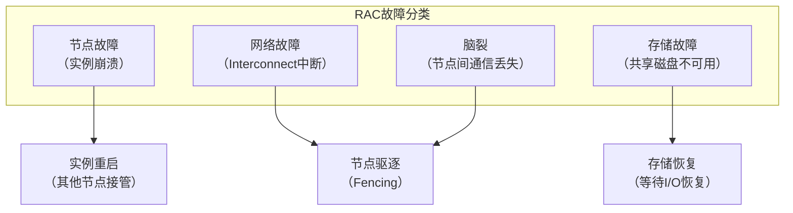
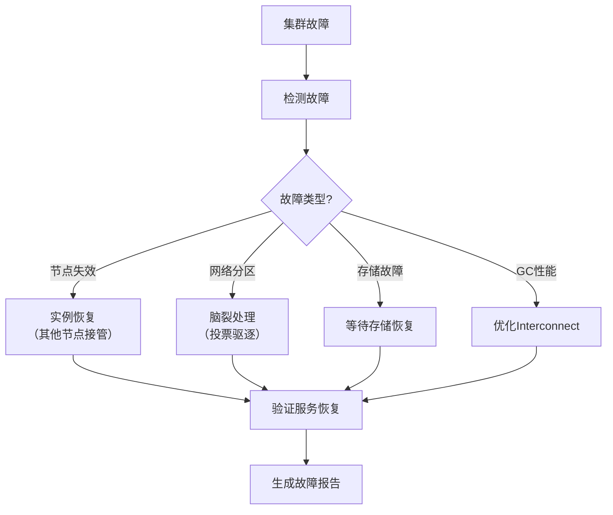

# Oracle集群故障

## 一、概述

### 1.1 一句话定义

Oracle集群故障是RAC或Data Guard环境中出现的节点失效、网络分区、脑裂和全局资源争用等问题，需要快速诊断和恢复以保障业务连续性。
它在集群环境异常时出现和使用，解决集群故障的快速定位和恢复问题。

### 1.2 为什么重要

- **不掌握的后果：** 集群故障导致业务长时间中断
- **掌握的价值：** 快速恢复集群，最小化业务影响

### 1.3 适用场景

| 场景 | 说明 |
|------|------|
| 节点失效 | 单节点宕机 |
| 脑裂 | 网络分区 |
| GC争用 | 全局缓存争用 |
| 切换失败 | 故障切换异常 |

## 二、术语与概念

### 2.1 核心术语表

| 术语 | 含义 | 类比 |
|------|------|------|
| RAC | 真正应用集群 | 多节点共享 |
| Split Brain | 脑裂 | 互相失联 |
| Eviction | 节点驱逐 | 踢出集群 |
| GC | 全局缓存 | 跨节点缓存 |
| Interconnect | 私有网络 | 节点间通信 |
| Fencing | 隔离 | 保护共享资源 |
| VIP | 虚拟IP | 故障转移地址 |

## 三、核心原理

### 3.1 RAC故障类型



### 3.2 节点失效处理

```sql
-- 诊断节点失效
-- 1. 检查集群状态
-- $ crsctl stat res -t
-- $ crsctl check cluster -all

-- 2. 查看集群日志
-- $ tail -100 $GRID_HOME/log/<hostname>/alert_<hostname>.log

-- 3. 检查实例状态
SELECT inst_id, instance_name, status FROM gv$instance;

-- 4. 节点失效后的自动处理
-- a) 其他节点检测到节点失联
-- b) 执行实例恢复（前滚+回滚）
-- c) 接管失效节点的服务
-- d) VIP漂移到存活节点

-- 5. 手动重启失效节点
-- $ srvctl start instance -d orcl -i orcl2
```

### 3.3 脑裂处理

```
脑裂场景：
节点A ←→ Interconnect ←→ 节点B
         （网络中断）

处理流程：
1. 两个节点都检测到通信丢失
2. CSS（Cluster Synchronization Services）介入
3. 通过投票磁盘（Voting Disk）决定保留哪个节点
4. 未获得多数票的节点被驱逐（Eviction）
5. 被驱逐节点重启

诊断：
- 查看CSS日志：$GRID_HOME/log/<hostname>/cssd/ocssd.log
- 关键词：reconfig, eviction, split brain
```

### 3.4 GC等待事件诊断

```sql
-- 全局缓存等待事件
SELECT inst_id, event, total_waits, time_waited_micro/1000000 AS sec
FROM gv$system_event
WHERE event LIKE 'gc%'
ORDER BY time_waited_micro DESC;

-- 常见GC等待事件
-- gc buffer busy acquire：获取GC缓冲区忙
-- gc buffer busy release：释放GC缓冲区忙
-- gc cr block busy：一致性读块获取慢
-- gc current block busy：当前块获取慢
-- gc cr grant 2-way：2路CR块授予
-- gc cr grant 3-way：3路CR块授予（跨节点多）

-- 诊断GC性能
SELECT inst_id, event, avg_wait*10 AS avg_ms
FROM gv$system_event
WHERE event LIKE 'gc%' AND avg_wait > 0
ORDER BY avg_wait DESC;

-- Interconnect性能
-- $ oifcfg getif
-- $ ping -s 8192 <other_node_interconnect_ip>

-- 优化GC性能
-- 1. 确保Interconnect使用专用网络（10Gbps+）
-- 2. 启用Jumbo Frame
-- 3. 减少跨节点访问（服务隔离）
```

### 3.5 Data Guard故障

```sql
-- Data Guard状态检查
SELECT database_role, protection_mode, open_mode FROM v$database;
SELECT status, message FROM v$dataguard_status WHERE severity IN ('Error', 'Fatal');

-- 常见DG故障
-- 1. 日志传输中断
SELECT dest_id, status, error FROM v$archive_dest WHERE dest_id = 2;
-- 解决：检查网络连接和备库状态

-- 2. 日志应用延迟
SELECT name, value, datum_time FROM v$dataguard_stats;
-- 解决：检查备库资源，手动应用归档

-- 3. 主备数据不一致
-- 解决：重新同步或从主库重新创建备库
```

## 四、架构与组件

### 4.1 集群故障处理流程



## 五、配置与调优

### 5.1 集群高可用配置

| 配置 | 建议值 | 说明 |
|------|--------|------|
| Interconnect | 10Gbps+ | 专用网络 |
| Voting Disk | 3个（奇数） | 防止脑裂 |
| SCAN | 3个IP | 负载均衡 |
| Fast Start Failover | 启用 | 自动切换 |
| TAF/TAF | 配置 | 应用透明切换 |

## 六、DFX能力

### 6.1 集群监控

```sql
-- 集群状态
SELECT inst_id, instance_name, status, startup_time FROM gv$instance;

-- 集群等待事件
SELECT inst_id, event, time_waited_micro/1000000 AS sec
FROM gv$system_event WHERE event LIKE 'gc%'
ORDER BY time_waited_micro DESC FETCH FIRST 10 ROWS ONLY;

-- Interconnect统计
SELECT * FROM gv$cluster_interconnects;
```

## 七、实战案例

### 7.1 案例：RAC节点驱逐

```
现象：节点2突然从集群消失
诊断：
1. CSS日志显示Interconnect超时
2. 网络交换机端口故障
3. 节点2被投票驱逐

处理：
1. 节点1自动接管节点2的服务
2. 更换网络交换机端口
3. 重启节点2加入集群
4. 服务自动回切

经验：
- Interconnect使用双网卡绑定
- 配置网络告警
```

## 八、常见错误与排查

| 故障 | 原因 | 解决方案 |
|------|------|---------|
| 节点驱逐 | Interconnect中断 | 冗余网络 |
| 脑裂 | 网络分区 | 奇数投票盘 |
| GC等待高 | Interconnect慢 | 升级网络 |
| DG中断 | 网络或备库问题 | 检查连接 |

## 九、最佳实践

- Interconnect使用专用冗余网络
- 投票磁盘使用3个（奇数）
- 配置SCAN和TAF实现透明切换
- 定期测试故障切换
- 监控GC等待事件趋势
- 建立集群故障处理SOP

## 十、命令与视图汇总

| 命令/视图 | 用途 |
|-----------|------|
| `crsctl stat res -t` | 集群资源状态 |
| `srvctl` | 集群管理 |
| `gv$instance` | 实例状态 |
| `gv$system_event` (gc) | GC等待 |
| `v$dataguard_status` | DG状态 |

## 十一、总结速查

| 故障 | 影响 | 恢复时间 |
|------|------|---------|
| 节点失效 | 服务中断 | 1-5分钟 |
| 脑裂 | 节点驱逐 | 2-10分钟 |
| GC争用 | 性能下降 | 优化后恢复 |
| DG中断 | 备库延迟 | 视情况 |

## 附录

### A. 集群故障处理SOP

```
1. 确认故障范围和影响
2. 检查集群日志（CSS/CRS/Alert）
3. 诊断故障根因
4. 执行恢复操作
5. 验证服务恢复
6. 生成故障报告
7. 制定改进措施
```

## 补充：深入分析与实战

### 深入原理

本章节补充了该主题的核心原理和内部机制。在实际生产环境中，理解这些底层原理对于诊断和优化至关重要。

关键要点：
- 内部实现机制决定了外部行为特征
- 参数配置需要结合具体场景
- 监控数据是调优的基础

### 实战案例

**案例一：生产环境问题诊断**

```sql
-- 诊断步骤
-- 1. 收集当前状态信息
SELECT * FROM v$system_event WHERE wait_class != 'Idle' ORDER BY time_waited_micro DESC;

-- 2. 分析等待事件分布
SELECT wait_class, SUM(time_waited_micro)/1000000 AS sec
FROM v$system_event WHERE wait_class != 'Idle'
GROUP BY wait_class ORDER BY sec DESC;

-- 3. 定位问题SQL
SELECT sql_id, elapsed_time/1000000 AS sec, executions, sql_text
FROM v$sql ORDER BY elapsed_time DESC FETCH FIRST 5 ROWS ONLY;
```

**案例二：性能优化实践**

```sql
-- 优化前：全表扫描
SELECT * FROM orders WHERE order_date > SYSDATE - 30;

-- 优化后：索引扫描
CREATE INDEX idx_orders_date ON orders(order_date);
```

### 最佳实践清单

- 建立标准化操作流程
- 定期审查和更新配置
- 监控关键指标趋势
- 建立性能基线
- 文档记录所有变更

### 常见问题FAQ

| 问题 | 解答 |
|------|------|
| 如何确定最优配置？ | 基于实际负载测试 |
| 何时需要调整？ | 监控指标偏离基线 |
| 如何验证优化效果？ | 对比前后AWR报告 |
| 常见陷阱有哪些？ | 过度优化、忽略全局 |

### 版本差异说明

| 版本 | 变化 |
|------|------|
| 19c | 自动管理增强 |
| 21c | 自适应优化 |

## 补充：监控与诊断

### 关键监控指标

```sql
-- 通用监控查询
SELECT name, value FROM v$sysstat
WHERE name LIKE '%relevant%' ORDER BY value DESC;

-- 性能基线对比
SELECT snap_id, begin_time, value
FROM dba_hist_sysstat
WHERE stat_name = 'relevant_stat'
AND snap_id > (SELECT MAX(snap_id) - 24 FROM dba_hist_snapshot);
```

### 诊断检查清单

- [ ] 检查系统资源使用情况
- [ ] 分析等待事件分布
- [ ] 审查TOP SQL执行计划
- [ ] 验证配置参数合理性
- [ ] 确认备份和恢复策略
- [ ] 检查安全审计日志

### 相关视图和工具

| 视图/工具 | 用途 |
|-----------|------|
| `v$system_event` | 等待事件统计 |
| `v$sql` | SQL执行统计 |
| `v$sesstat` | 会话级统计 |
| `AWR Report` | 历史性能分析 |
| `ASH Report` | 实时性能分析 |

### 参考资料

- Oracle Database Performance Tuning Guide
- Oracle Database Administration Guide
- Oracle Database Concepts

## 补充：扩展知识与实践总结

### 扩展阅读

本主题涉及的知识面较广，建议结合以下方面深入学习：

1. **官方文档**：Oracle Database文档是最权威的参考
2. **MOS（My Oracle Support）**：获取补丁和技术支持
3. **Oracle Base**：Tim Hall的优质教程资源
4. **Oracle-Base.com**：实战案例和最佳实践
5. **社区论坛**：Oracle-L邮件列表和Stack Overflow

### 知识体系关联

```
本主题在Oracle知识体系中的位置：
├── 基础知识（P1）
├── 核心原理（P2）
├── 管理运维（P3）
├── 编程开发（P4）
├── 性能优化（P5）
├── 高可用集群（P6）
├── 内核机制（P7）
└── 架构设计（P8）← 本主题
```

### 实践经验总结

| 经验 | 说明 |
|------|------|
| 先理解再实践 | 理解原理后再动手 |
| 小步快跑 | 逐步验证，不要一次大改 |
| 数据驱动 | 基于监控数据做决策 |
| 文档记录 | 记录所有操作和变更 |
| 复盘总结 | 事后回顾和改进 |

### 学习路径建议

```
入门 → 基础概念和术语
↓
进阶 → 核心原理和机制
↓
实战 → 生产环境操作
↓
深入 → 内核机制和调优
↓
架构 → 系统设计和规划
```

### 关键要点回顾

1. 理解核心概念是基础
2. 实践操作是关键
3. 监控诊断是保障
4. 持续学习是必须
