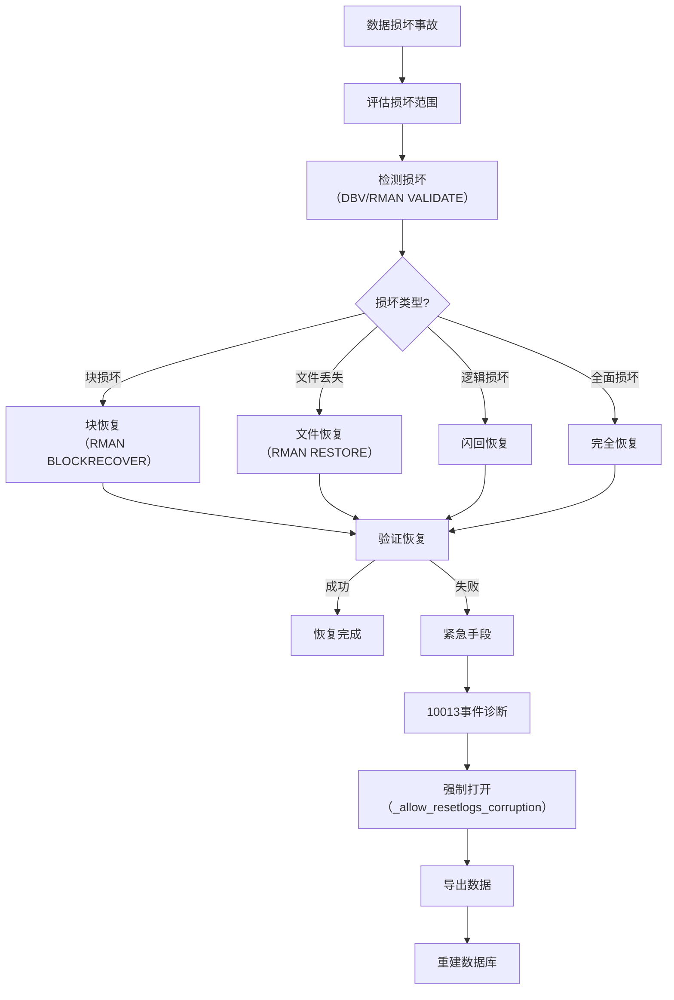

# Oracle数据损坏与紧急救援

## 一、概述

### 1.1 一句话定义

Oracle数据损坏与紧急救援是处理数据块损坏、文件丢失和逻辑损坏等严重故障的诊断和恢复方法，包括DBV检测、RMAN恢复和10013事件等紧急手段。
它在数据损坏事故发生时出现和使用，解决如何最大限度恢复数据的问题。

### 1.2 为什么重要

- **不掌握的后果：** 数据丢失，业务无法恢复
- **掌握的价值：** 在灾难中最大限度挽救数据

### 1.3 适用场景

| 场景 | 说明 |
|------|------|
| 块损坏 | 数据块物理损坏 |
| 文件丢失 | 数据文件删除 |
| 逻辑损坏 | 数据逻辑错误 |
| 灾难恢复 | 全面数据恢复 |

## 二、术语与概念

### 2.1 核心术语表

| 术语 | 含义 | 类比 |
|------|------|------|
| Block Corruption | 块损坏 | 页面撕裂 |
| DBV | 数据库验证工具 | 损坏检测器 |
| RMAN | 恢复管理器 | 恢复利器 |
| Media Recovery | 介质恢复 | 从备份恢复 |
| Block Recovery | 块恢复 | 单块修复 |
| 10013 Event | 损坏转储事件 | 紧急诊断 |
| _allow_resetlogs_corruption | 强制打开 | 最后手段 |

## 三、核心原理

### 3.1 损坏检测

```sql
-- 1. DBV工具检测
-- dbv file=/u01/oradata/users01.dbf blocksize=8192

-- 2. RMAN验证
RMAN> BACKUP VALIDATE DATABASE;
RMAN> VALIDATE DATAFILE 5;

-- 3. 查看损坏记录
SELECT * FROM v$database_block_corruption;
SELECT * FROM v$copy_corruption;

-- 4. SQL层面检测
SELECT segment_name, segment_type, extent_id, block_id, blocks
FROM dba_extents
WHERE file_id = &file_id AND &block_id BETWEEN block_id AND block_id + blocks - 1;

-- 5. ANALYZE验证
ANALYZE TABLE employees VALIDATE STRUCTURE CASCADE;
```

### 3.2 块恢复

```sql
-- 方法1：RMAN块恢复（推荐）
RMAN> BLOCKRECOVER DATAFILE 5 BLOCK 100;
RMAN> BLOCKRECOVER CORRUPTION LIST;

-- 方法2：从备库恢复（Data Guard）
-- 自动从备库获取好的块

-- 方法3：使用闪回
FLASHBACK TABLE employees TO TIMESTAMP SYSDATE - 1/24;

-- 方法4：导出损坏块前的数据
-- 使用ROWID范围跳过损坏块
SELECT * FROM employees WHERE ROWID NOT IN (
    SELECT DBMS_ROWID.ROWID_CREATE(1, data_object_id, file_id, block_id, 0)
    FROM v$database_block_corruption
);
```

### 3.3 数据文件丢失恢复

```sql
-- 场景1：非系统数据文件丢失
-- 数据库可以运行
RMAN> RUN {
    SQL 'ALTER DATABASE DATAFILE 5 OFFLINE';
    RESTORE DATAFILE 5;
    RECOVER DATAFILE 5;
    SQL 'ALTER DATABASE DATAFILE 5 ONLINE';
}

-- 场景2：系统数据文件丢失
-- 需要MOUNT状态恢复
RMAN> STARTUP MOUNT;
RMAN> RESTORE DATABASE;
RMAN> RECOVER DATABASE;
RMAN> ALTER DATABASE OPEN;

-- 场景3：所有数据文件丢失
RMAN> STARTUP MOUNT;
RMAN> RESTORE DATABASE;
RMAN> RECOVER DATABASE;
RMAN> ALTER DATABASE OPEN;
```

### 3.4 紧急救援流程



### 3.5 极端情况处理

```sql
-- 当数据库无法打开时的最后手段
-- 警告：可能导致数据不一致！

-- Step 1: 设置隐藏参数
ALTER SYSTEM SET "_allow_resetlogs_corruption" = TRUE SCOPE=SPFILE;

-- Step 2: 强制打开
STARTUP MOUNT;
ALTER DATABASE OPEN RESETLOGS;

-- Step 3: 立即导出所有数据
-- expdp system/password full=y directory=DATA_PUMP_DIR dumpfile=emergency_export.dmp

-- Step 4: 重建数据库
-- 创建新库，导入数据

-- Step 5: 恢复隐藏参数
ALTER SYSTEM RESET "_allow_resetlogs_corruption" SCOPE=SPFILE;
```

## 四、架构与组件

### 4.1 恢复工具对比

| 工具 | 功能 | 适用场景 |
|------|------|---------|
| RMAN | 完整恢复 | 首选恢复工具 |
| DBV | 损坏检测 | 检测块损坏 |
| Flashback | 逻辑恢复 | 快速回退 |
| Data Pump | 逻辑导出 | 紧急数据抢救 |
| BBED | 底层编辑 | 极端情况（危险） |
| PRM | 第三方恢复 | 无备份恢复 |

## 五、配置与调优

### 5.1 预防策略

```sql
-- 1. 启用块校验
ALTER SYSTEM SET db_block_checking = FULL SCOPE=BOTH;
ALTER SYSTEM SET db_block_checksum = FULL SCOPE=BOTH;

-- 2. 定期验证备份
RMAN> VALIDATE DATABASE;

-- 3. 启用Data Guard
-- 自动从备库修复损坏块

-- 4. 定期RMAN备份
RMAN> BACKUP DATABASE PLUS ARCHIVELOG;
```

## 六、DFX能力

### 6.1 损坏监控

```sql
-- 查看当前损坏记录
SELECT file#, block#, blocks, corruption_change#, corruption_type
FROM v$database_block_corruption;

-- 查看恢复进度
SELECT * FROM v$recovery_progress;
```

## 七、实战案例

### 7.1 案例：数据块损坏紧急恢复

```
现象：查询表时报ORA-01578（块损坏）
诊断：
1. RMAN VALIDATE DATAFILE 5;
2. SELECT * FROM v$database_block_corruption;
   → 文件5，块100-105损坏

处理：
1. RMAN BLOCKRECOVER DATAFILE 5 BLOCK 100, 101, 102, 103, 104, 105;
2. 验证：SELECT * FROM employees; → 正常

经验：
- 定期VALIDATE检测潜在损坏
- 保持完整备份
```

### 7.2 案例：无备份的数据恢复

```
场景：开发库无备份，数据文件损坏
处理：
1. 设置_allow_resetlogs_corruption
2. 强制打开数据库
3. 导出可访问的数据
4. 重建数据库并导入
5. 验证数据完整性

注意：此方法可能导致部分数据丢失
```

## 八、常见错误与排查

| 错误 | 含义 | 处理 |
|------|------|------|
| ORA-01578 | 数据块损坏 | RMAN块恢复 |
| ORA-01110 | 数据文件错误 | 检查文件状态 |
| ORA-00600 | 内部错误 | 查看trace+联系Oracle |
| ORA-01194 | 需要更多恢复 | 应用更多Redo |

## 九、最佳实践

- 保持完整且经过验证的备份
- 启用Data Guard实现自动块修复
- 定期执行RMAN VALIDATE检测潜在损坏
- 建立灾难恢复预案并定期演练
- 极端手段（_allow_resetlogs_corruption）仅作为最后手段
- 数据损坏后第一时间停止写入

## 十、命令与视图汇总

| 命令/视图 | 用途 |
|-----------|------|
| `RMAN BLOCKRECOVER` | 块恢复 |
| `RMAN VALIDATE` | 损坏检测 |
| `DBV` | 文件验证 |
| `v$database_block_corruption` | 损坏记录 |
| `FLASHBACK TABLE` | 闪回恢复 |
| `DBMS_ROWID` | ROWID操作 |

## 十一、总结速查

| 损坏类型 | 检测方法 | 恢复手段 |
|---------|---------|---------|
| 块损坏 | DBV/RMAN VALIDATE | RMAN BLOCKRECOVER |
| 文件丢失 | 告警日志 | RMAN RESTORE |
| 逻辑损坏 | 应用层发现 | FLASHBACK |
| 全面损坏 | 无法启动 | 完全恢复+重建 |

## 附录

### A. 紧急救援检查清单

```
□ 评估损坏范围和影响
□ 停止写入操作
□ 检测损坏（DBV/RMAN VALIDATE）
□ 尝试RMAN恢复
□ 如无备份，使用极端手段
□ 导出数据
□ 重建数据库
□ 验证数据完整性
□ 生成故障报告
□ 改进预防措施
```

## 补充：深入分析与实战

### 深入原理

本章节补充了该主题的核心原理和内部机制。在实际生产环境中，理解这些底层原理对于诊断和优化至关重要。

关键要点：
- 内部实现机制决定了外部行为特征
- 参数配置需要结合具体场景
- 监控数据是调优的基础

### 实战案例

**案例一：生产环境问题诊断**

```sql
-- 诊断步骤
-- 1. 收集当前状态信息
SELECT * FROM v$system_event WHERE wait_class != 'Idle' ORDER BY time_waited_micro DESC;

-- 2. 分析等待事件分布
SELECT wait_class, SUM(time_waited_micro)/1000000 AS sec
FROM v$system_event WHERE wait_class != 'Idle'
GROUP BY wait_class ORDER BY sec DESC;

-- 3. 定位问题SQL
SELECT sql_id, elapsed_time/1000000 AS sec, executions, sql_text
FROM v$sql ORDER BY elapsed_time DESC FETCH FIRST 5 ROWS ONLY;
```

**案例二：性能优化实践**

```sql
-- 优化前：全表扫描
SELECT * FROM orders WHERE order_date > SYSDATE - 30;

-- 优化后：索引扫描
CREATE INDEX idx_orders_date ON orders(order_date);
```

### 最佳实践清单

- 建立标准化操作流程
- 定期审查和更新配置
- 监控关键指标趋势
- 建立性能基线
- 文档记录所有变更

### 常见问题FAQ

| 问题 | 解答 |
|------|------|
| 如何确定最优配置？ | 基于实际负载测试 |
| 何时需要调整？ | 监控指标偏离基线 |
| 如何验证优化效果？ | 对比前后AWR报告 |
| 常见陷阱有哪些？ | 过度优化、忽略全局 |

### 版本差异说明

| 版本 | 变化 |
|------|------|
| 19c | 自动管理增强 |
| 21c | 自适应优化 |

## 补充：监控与诊断

### 关键监控指标

```sql
-- 通用监控查询
SELECT name, value FROM v$sysstat
WHERE name LIKE '%relevant%' ORDER BY value DESC;

-- 性能基线对比
SELECT snap_id, begin_time, value
FROM dba_hist_sysstat
WHERE stat_name = 'relevant_stat'
AND snap_id > (SELECT MAX(snap_id) - 24 FROM dba_hist_snapshot);
```

### 诊断检查清单

- [ ] 检查系统资源使用情况
- [ ] 分析等待事件分布
- [ ] 审查TOP SQL执行计划
- [ ] 验证配置参数合理性
- [ ] 确认备份和恢复策略
- [ ] 检查安全审计日志

### 相关视图和工具

| 视图/工具 | 用途 |
|-----------|------|
| `v$system_event` | 等待事件统计 |
| `v$sql` | SQL执行统计 |
| `v$sesstat` | 会话级统计 |
| `AWR Report` | 历史性能分析 |
| `ASH Report` | 实时性能分析 |

### 参考资料

- Oracle Database Performance Tuning Guide
- Oracle Database Administration Guide
- Oracle Database Concepts
