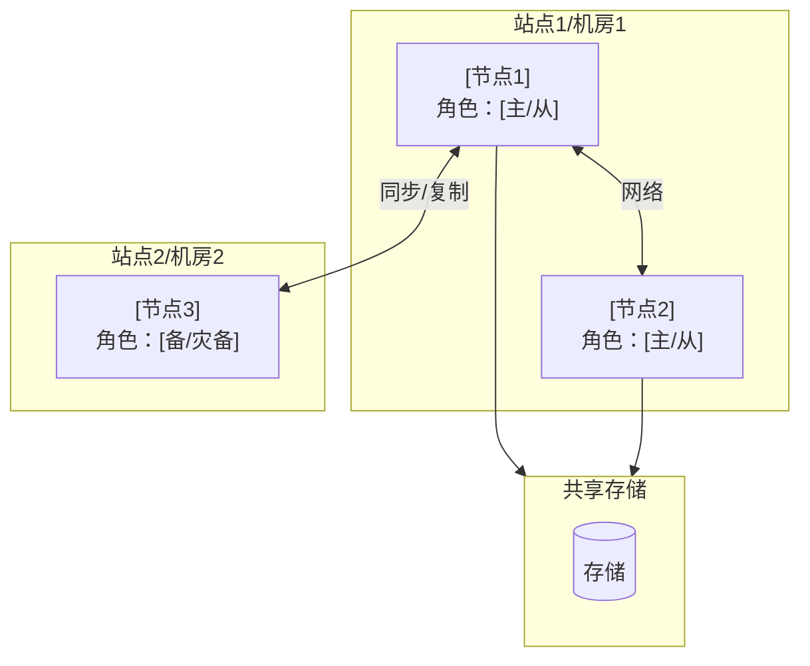
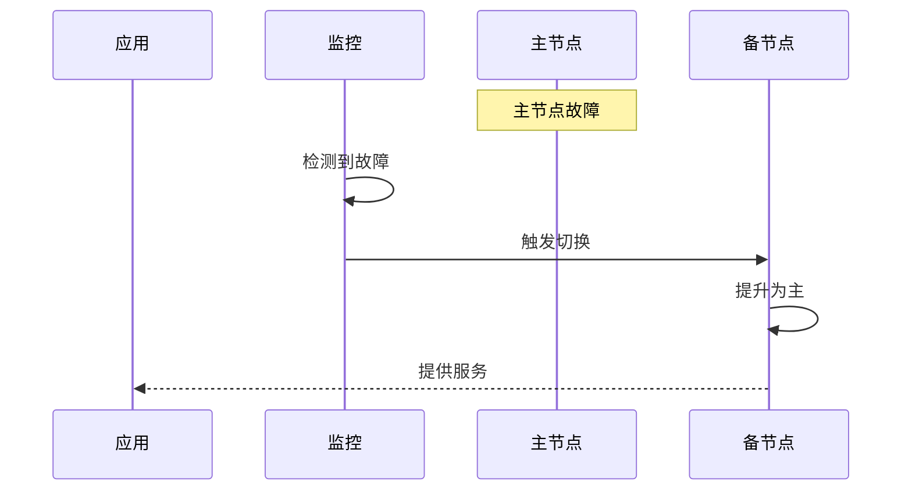

# 架构对比类模板

> **适用场景**：高可用方案、部署拓扑、技术选型、架构设计
>
> **目标读者**：架构师、高级DBA、技术决策者
>
> **核心关注**：评估"选哪个方案"

---

## 文档元数据

```yaml
知识库ID: YDB-ARCH-[序号]
标题: [架构/方案名称]
分类: 架构对比
认知阶段: ■架构生态
关联知识: [相关知识点ID]
适用版本: [YashanDB版本号]
最后更新: [YYYY-MM-DD]
```


# 资料来源追溯（必填，评分规则详见 config/shared/traceability-rules.md）
资料来源追溯:
  主要来源：[YashanDB 知识库 MCP / 特性设计文档 / Oracle 知识库]
  引用文档数量: [数字]
  关键引用:
    - "[文档标题]" (ku_name: [ku_name])
  辅助来源：[其他来源及文档数量]
  大模型推理内容:
    - [无法溯源的内容列表]
  
  引用覆盖率分析:
    总事实陈述数：[统计数字]
    有引用的事实陈述数：[统计数字]
    引用覆盖率：[百分比]%
    
    按来源分布:
      YashanDB 知识库 MCP: [数字] 条（[百分比]%）
      Oracle 知识库: [数字] 条（[百分比]%）
      大模型推理（已标注）: [数字] 条（[百分比]%）
      未标注来源: [数字] 条（[百分比]%）
  
  评分明细:
    引用覆盖率得分：[0-60]/60（[百分比]%）
    来源权威性得分：[0-25]/25（MCP 占比 [百分比]%）
    推理透明度得分：[0-15]/15（[标注情况]）
    综合评分：[总分]/100
  
  可信度等级：[A+/A/B+/B/C/D] 级（[标签]）
  风险标注:
    - [具体风险说明]
---

## 一、一句话定义

<!-- 填写指南：一句话定义该架构的目的和核心运作方式 -->

> [一句话定义该架构的目的和核心运作方式]

---

## 二、解决了什么？

### 痛点

- [单点故障、扩展瓶颈、性能上限等问题]

### 收益

- [高可用、可扩展、负载均衡等收益]

---

## 三、工作原理（简要）

<!-- 填写指南：简要说明该架构的核心运作逻辑，不需要深入内部细节 -->

1. [关键步骤1]
2. [关键步骤2]
3. [关键步骤3]

---

## 四、架构部署图

<!-- 填写指南：用 Mermaid 绘制该架构的部署拓扑图 -->



### 组件说明

| 组件 | 角色 | 职责 |
|------|------|------|
| [组件1] | [角色] | [职责描述] |
| [组件2] | [角色] | [职责描述] |

---

## 五、方案对比

<!-- 填写指南：对比同类架构的不同方案，帮助读者选型 -->

| 方案 | 拓扑描述 | 优点 | 缺点 | 适用场景 | RPO | RTO |
|------|---------|------|------|---------|-----|-----|
| [方案A] | [简要] | [优点] | [缺点] | [场景] | [值] | [值] |
| [方案B] | [简要] | [优点] | [缺点] | [场景] | [值] | [值] |
| [方案C] | [简要] | [优点] | [缺点] | [场景] | [值] | [值] |

---

## 六、选型建议

<!-- 填写指南：根据不同业务场景给出选型建议 -->

| 业务场景 | 推荐方案 | 理由 |
|---------|---------|------|
| [场景1：如金融核心系统] | [推荐方案] | [理由] |
| [场景2：如内部管理系统] | [推荐方案] | [理由] |
| [场景3：如互联网应用] | [推荐方案] | [理由] |

---

## 七、关键配置与监控

### 核心配置

```ini
# [配置文件名]
[配置项1] = [值]    # [说明]
[配置项2] = [值]    # [说明]
```

### 监控指标

| 指标 | 采集方式 | 健康基线 | 告警阈值 |
|------|---------|---------|---------|
| [指标1] | [如何采集] | [正常范围] | [告警值] |

### 健康检查

```sql
-- [健康检查SQL]
[具体SQL]
```

---

## 八、故障转移流程

<!-- 填写指南：描述故障发生时的自动/手动切换过程 -->



### 切换步骤

1. [步骤1]
2. [步骤2]
3. [步骤3]

---

## 九、避坑指南

### ✅ 选型建议和高可用验证方法

- [架构设计最佳实践]
- [高可用验证方法：如定期演练]

### ❌ 常见错误配置及后果

| 错误配置 | 后果 | 正确做法 |
|---------|------|---------|
| [错误配置] | [导致的后果] | [正确做法] |

---

## 十、自测复述

- [ ] 我能画出该架构的数据流图和部署拓扑图吗？
- [ ] 我能讲清楚各组件的角色和交互方式吗？
- [ ] 我能根据不同业务场景给出合理的选型建议吗？
- [ ] 我知道故障转移的完整流程和验证方法吗？

---

## 十一、进一步学习

- **关联知识**：[相关知识点ID]
- **深入阅读**：[官方文档/架构白皮书]

---

## 填写检查清单

- [ ] 有清晰的架构部署图（Mermaid）
- [ ] 方案对比表包含至少2个方案
- [ ] 有针对不同场景的选型建议
- [ ] 有关键配置和监控指标
- [ ] 有故障转移流程描述
