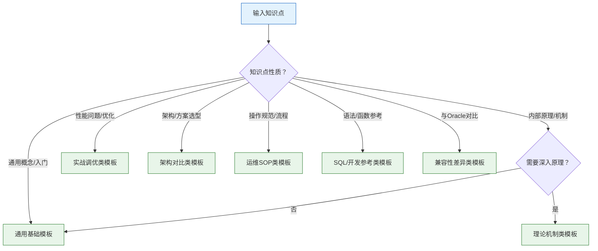

# YashanDB 知识模板体系 — 设计思路

## 一、设计背景

### 1.1 问题定义

YashanDB 知识库构建需要一套标准化的文档模板体系，解决以下问题：

- **知识碎片化**：散落在工单、邮件、个人笔记中的知识缺乏统一结构
- **生成质量不一**：每次手写提示词，输出质量波动大
- **复用困难**：相同知识点无法快速适配不同读者场景
- **验证困难**：缺乏标准化结构，难以自动化验证

### 1.2 设计目标

| 目标 | 说明 |
|------|------|
| **结构化** | 每篇知识文档有清晰的章节结构，便于阅读和检索 |
| **可复用** | 同一知识点可快速适配不同读者（DBA/开发者/运维） |
| **可验证** | 标准化结构支持自动化验证（如双库测试） |
| **可扩展** | 核心模板覆盖主要场景，预留扩展接口 |

---

## 二、分类维度：按知识类型

### 2.1 为什么按知识类型分类？

| 方案 | 优点 | 缺点 | 结论 |
|------|------|------|------|
| **按知识类型** | 灵活度高，同一知识点可服务不同读者 | 需要判断知识类型 | ✅ **采用** |
| 按领域分类 | 领域特征突出 | 模板数量多，复用性差 | ❌ |
| 二维矩阵 | 最完整 | 复杂度高，维护成本大 | ❌ |

### 2.2 知识类型定义

根据知识的性质和使用场景，划分为 **7 种核心类型**：

| 类型 | 典型场景 | 目标读者 | 核心关注点 |
|------|---------|---------|-----------|
| **通用基础** | 通用概念、入门知识 | 所有读者 | 快速理解"是什么" |
| **理论机制** | 索引原理、事务隔离、存储引擎 | DBA/架构师 | 深入理解"为什么" |
| **实战调优** | 慢查询优化、参数调优、性能诊断 | DBA/运维 | 解决"怎么做" |
| **架构对比** | 高可用方案、部署拓扑、技术选型 | 架构师/DBA | 评估"选哪个" |
| **运维SOP** | 部署规范、巡检规范、应急预案 | 运维工程师 | 标准化"按步骤做" |
| **SQL/开发参考** | SQL语法、PL/SQL、函数参考 | 开发者 | 快速查找"怎么用" |
| **兼容性差异** | 与Oracle功能差异、迁移指南 | DBA/开发者 | 明确"差在哪" |

---

## 三、模板清单（7个核心模板）

### 3.1 核心模板列表

| 序号 | 模板名称 | 文件名 | 适用场景 |
|------|---------|--------|---------|
| 1 | 通用基础模板 | `01-通用基础模板.md` | 所有知识点的默认模板 |
| 2 | 理论机制类模板 | `02-理论机制类模板.md` | 索引原理、事务隔离、存储引擎等 |
| 3 | 实战调优类模板 | `03-实战调优类模板.md` | 慢查询优化、参数调优、性能诊断 |
| 4 | 架构对比类模板 | `04-架构对比类模板.md` | 高可用方案、部署拓扑、技术选型 |
| 5 | 运维SOP类模板 | `05-运维SOP类模板.md` | 部署规范、巡检规范、应急预案 |
| 6 | SQL/开发参考类模板 | `06-SQL开发参考类模板.md` | SQL语法、PL/SQL、函数参考 |
| 7 | 兼容性差异类模板 | `07-兼容性差异类模板.md` | 与Oracle功能差异、迁移指南 |

### 3.2 模板选择决策树

---

## 四、模板结构设计原则

### 4.1 统一结构

所有模板遵循统一的元数据区和基础章节：

| 区域 | 说明 | 是否必选 |
|------|------|---------|
| **元数据区** | 知识库ID、标题、分类、关联知识等 | ✅ 必选 |
| **一句话定义** | 用最简练的语言定义概念 | ✅ 必选 |
| **解决了什么** | 痛点和收益 | ✅ 必选 |
| **核心概念** | 关键术语表 | ✅ 必选 |
| **工作原理/核心内容** | 根据类型不同，章节名称和深度不同 | ✅ 必选 |
| **操作示例** | SQL、命令、配置示例 | ✅ 必选 |
| **避坑指南** | 最佳实践和常见错误 | ✅ 必选 |
| **自测复述** | 验证理解的检查清单 | ✅ 必选 |

### 4.2 差异化章节

根据知识类型，增加或调整特定章节：

| 模板类型 | 差异化章节 |
|---------|-----------|
| 理论机制类 | 增加"核心结构图"、"设计权衡"、"内部流程深度拆解" |
| 实战调优类 | 增加"诊断流程"、"真实案例"、"优化前后对比" |
| 架构对比类 | 增加"架构部署图"、"方案对比表"、"选型建议" |
| 运维SOP类 | 增加"前置条件"、"步骤化操作"、"回滚方案"、"验证清单" |
| SQL/开发参考类 | 增加"语法格式"、"参数说明"、"示例代码"、"返回值" |
| 兼容性差异类 | 增加"Oracle行为"、"YashanDB行为"、"差异点"、"迁移建议" |

### 4.3 占位符规范

模板中使用统一的占位符格式：

| 占位符格式 | 说明 | 示例 |
|-----------|------|------|
| `[占位符名称]` | 必填项，需要替换为实际内容 | `[知识条目标题]` |
| `{可选内容}` | 可选项，根据实际情况填写 | `{关联知识ID}` |
| `<!-- 填写指南 -->` | HTML注释形式的填写说明 | `<!-- 用一句话定义该概念 -->` |

---

## 五、使用指南

### 5.1 人工使用流程

1. **确定知识类型**：根据知识点性质，参考决策树选择模板
2. **复制模板**：复制对应模板文件
3. **填充内容**：按照占位符和填写指南，填充实际内容
4. **审阅验证**：检查结构完整性、内容准确性

### 5.2 AI生成流程

1. **输入知识点**：提供知识点名称和简要描述
2. **类型判断**：AI根据知识点性质自动判断类型
3. **选择模板**：AI调用对应模板
4. **生成文档**：AI填充模板，生成完整文档
5. **人工审阅**：DBA/领域专家审阅并修正

### 5.3 与知识库构建流程的集成

---

## 六、扩展机制

### 6.1 预留扩展接口

当前 7 个核心模板覆盖主要场景，后续可按需扩展：

| 扩展方向 | 示例模板 | 触发条件 |
|---------|---------|---------|
| 细分领域模板 | "高可用领域-理论机制模板" | 某领域知识量大，需要更精细分类 |
| 特定读者模板 | "DBA入门模板"、"开发者速查模板" | 同一知识点需要适配不同读者层次 |
| 混合类型模板 | "理论+调优混合模板" | 知识点跨越多个类型 |

### 6.2 模板版本管理

- 每个模板文件包含版本号
- 重大变更时更新版本号
- 保留历史版本，便于追溯

---

## 七、总结

本模板体系采用**按知识类型分类**的方式，设计了 **7 个核心模板**，覆盖 YashanDB 知识库的主要场景。每个模板采用**结构化骨架 + 填写指南**的形式，既保证结构统一，又保留灵活性。

**核心特点**：

- ✅ **分类清晰**：7 种知识类型，覆盖从入门到精通
- ✅ **结构统一**：统一的元数据区和基础章节
- ✅ **差异化章节**：根据类型增加特定章节
- ✅ **可扩展**：预留扩展接口，支持后续细化

**下一步**：逐个生成 7 个核心模板文件。
