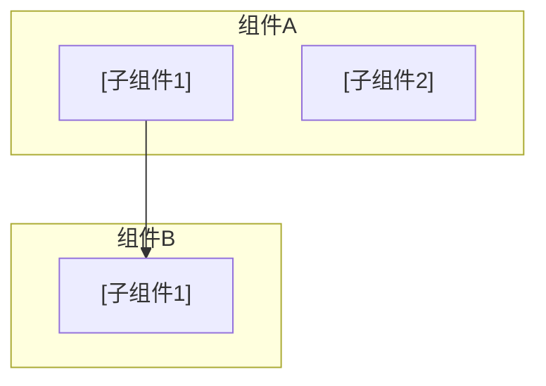
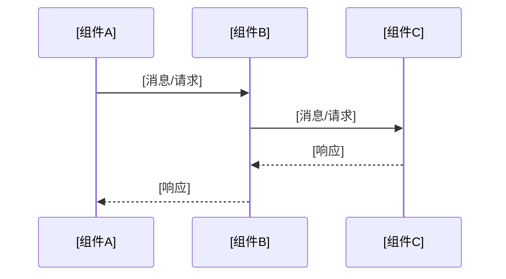

# 理论机制类模板

> **适用场景**：索引原理、事务隔离级别、存储引擎、锁机制等内部原理
>
> **目标读者**：DBA、架构师、需要深入理解原理的技术人员
>
> **核心关注**：深入理解"为什么这样设计"

---

## 文档元数据

```yaml
知识库ID: YDB-INTERNAL-[序号]
标题: [精确概括该机制名称]
分类: 理论机制
认知阶段: ■内部机理
关联知识: [相关知识点ID]
适用版本: [YashanDB版本号]
最后更新: [YYYY-MM-DD]
```

---

## 一、一句话定义

<!-- 填写指南：用一句话定义该机制的本质和核心作用 -->

> [一句话定义该机制的本质和核心作用]

---

## 二、解决了什么？

### 痛点

- [没有该机制时，系统面临的具体问题]

### 收益

- [引入该机制后，解决了什么问题，带来了什么好处]

---

## 三、核心概念

| 术语 | 定义 | 类比 |
|------|------|------|
| [术语1] | [专业解释] | [生活化类比] |
| [术语2] | [专业解释] | [生活化类比] |

---

## 四、核心结构

<!-- 填写指南：用结构图或示意图展示该机制的核心组件和关系 -->

### 结构图



### 组件说明

| 组件 | 职责 | 关键特性 |
|------|------|---------|
| [组件A] | [职责描述] | [特性] |
| [组件B] | [职责描述] | [特性] |

---

## 五、工作原理（深度拆解）

<!-- 填写指南：分步骤、分阶段详细解释该机制的运作过程 -->

### 阶段1：[阶段名称]

1. [步骤1：触发条件]
2. [步骤2：处理过程]
3. [步骤3：中间结果]

### 阶段2：[阶段名称]

1. [步骤1]
2. [步骤2]
3. [步骤3]

### 关键流程时序图



---

## 六、设计权衡

<!-- 填写指南：解释为什么采用这种设计，对比其他可能的方案 -->

### 方案对比

| 对比维度 | 当前方案 | 备选方案A | 备选方案B |
|---------|---------|----------|----------|
| [维度1：如性能] | [描述] | [描述] | [描述] |
| [维度2：如复杂度] | [描述] | [描述] | [描述] |
| [维度3：如可扩展性] | [描述] | [描述] | [描述] |

### 为什么选择当前方案？

- [原因1：如性能优先]
- [原因2：如兼容性考虑]
- [原因3：如实现复杂度]

---

## 七、常见操作与验证

<!-- 填写指南：提供验证该机制行为的 SQL 或命令 -->

### 查看/验证机制状态

```sql
-- [操作说明]
[SQL或命令示例]
```

### 观察机制行为

```sql
-- [操作说明：如何观察该机制的实际运作]
[SQL或命令示例]
```

---

## 八、避坑指南

### ✅ 最佳实践

- [最佳实践1：如何利用该机制提升性能/可靠性]
- [最佳实践2]

### ❌ 常见反模式

| 反模式 | 问题 | 正确做法 |
|--------|------|---------|
| [错误做法] | [导致的问题] | [正确做法] |

---

## 九、自测复述

- [ ] 我能画出该机制的核心结构图吗？
- [ ] 我能解释它的完整工作流程（分阶段）吗？
- [ ] 我能解释为什么它被设计成这个样子，而不是另一种？
- [ ] 我知道它的性能特征和限制条件吗？

---

## 十、进一步学习

- **关联知识**：[相关知识点ID]
- **深入阅读**：[官方文档/论文/参考资料]

---

## 填写检查清单

- [ ] 核心结构有清晰的示意图
- [ ] 工作原理分阶段、分步骤详细拆解
- [ ] 有设计权衡分析（为什么这样设计）
- [ ] 有验证机制行为的 SQL/命令
- [ ] 避坑指南包含反模式和正确做法
